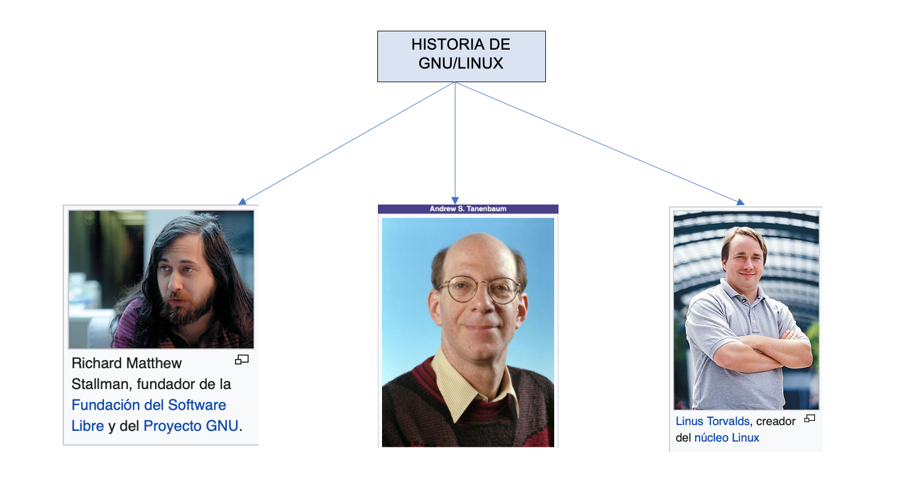
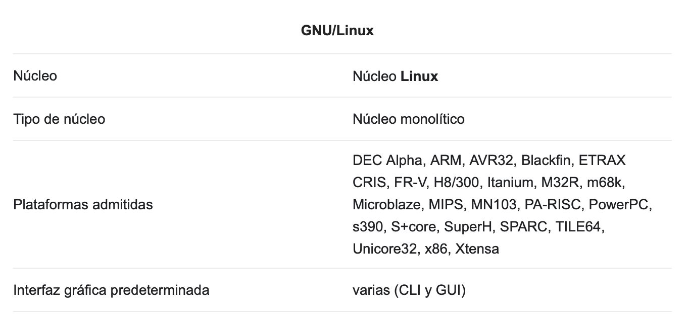
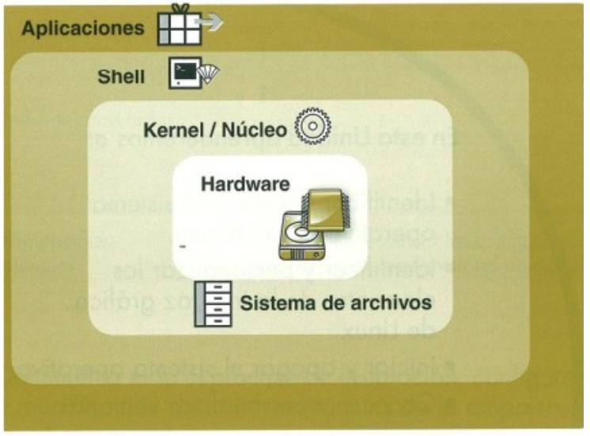

# Shell Scripting

??? abstract "Duración y criterios de evaluación"

    **Duración estimada: 3 sesiones (2h por sesión)**

    <hr />

    Resultado de aprendizaje y Criterios de evaluación:

    1. Utiliza lenguajes de guiones en sistemas operativos, describiendo su aplicación y administrando servicios del sistema operativo.
        1. Se han utilizado y combinado las estructuras del lenguaje para crear guiones.
        2. Se han utilizado herramientas para depurar errores sintácticos y de ejecución.
        3. Se han interpretado guiones de configuración del sistema operativo.
        4. Se han realizado cambios y adaptaciones de guiones del sistema.
        5. Se han creado y probado guiones de administración de servicios.
        6. Se han creado y probado guiones de automatización de tareas.
        7. Se han implantado guiones en **sistemas libres**.
        8. Se han consultado y utilizado librerías de funciones.
        9. Se han documentado los guiones creados.

## Introducción Linux

### Breve Historia

* **1969** La empresa AT&T desarrolla el sistema operativo UNIX y vendido posteriormente a Novell.
* **1983** Richard Stallman comienza el proyecto GNU (GNU is Not Unix) para crear un SO tipo UNIX pero de software libre.
    * Software libre: Aquel software, que una vez adquirido (no tiene porque ser gratuito), puede ser usado, copiado, modificado y redistribuido, con cambios o mejoras.
* **1985** Microsoft publica Windows, un sistema operativo con interfaz gráfica de usuario (GUI) para su sistema operativo MS-DOS.
* **1991** Linus Torvald comienza a programar el sistema operativo Linux (Linus + UNIX). El código era totalmente nuevo, pero emulaba el funcionamiento del sistema operativo MINIX (Tanenbaum), con estructura de micronucleo.
* **1992** Se juntan el proyecto Linux y GNU → GNU/Linux.
* **2001** Se lanza el primer sistema operativo MAC (MAC OS X) con interfaz de escritorio. MAC está basado en UNIX.

### Principales Actores
<figure>
  
  <figcaption>Principales Actores en la creación de GNU/Linux</figcaption>
</figure>

### Características

* **Software Libre** → Cualquiera puede usarlo o descargarlo.
    * Licencias GPL (General Public License) de GNU. La Licencia Pública General de GNU o más conocida por su nombre en inglés **GNU General Public License** es una licencia de derecho de autor ampliamente usada en el mundo del software libre y código abierto, ​ y garantiza a los usuarios finales la libertad de usar, estudiar, compartir y modificar el software.
* **Código Abierto** → Cualquiera puede ver y modificar el código.
* En la siguiente tabla se muestra algunas de las principales características.

<figure>
  
  <figcaption>Tabla con algunas características de Linux</figcaption>
</figure>

### Distribuciones

* Gratuitas:
    * Ubuntu, CentOS, Mint, Fedora, Knoppix, OpenSUSE.
    * En el caso de Ubuntu sacan distribuciones LTS que tienen mayor tiempo de actualizaciones. 
    * Las versiones indican el año y el mes en que se saca dicha versión.
        * Por ejemplo 17.04 (Año 2017, Abril).
* Pago: RedHat o SUSE.
    * Se paga por el soporte, no por el software en sí.
    * Las distribuciones de pago también suelen tener sus versiones gratuitas.

### Principales distribuciones
<figure>
  
  <figcaption>Algunas Distribuciones de Linux</figcaption>
</figure>

### Shell

* En informática, el **shell o intérprete de órdenes** o intérprete de comandos es el programa informático que provee una interfaz de usuario para acceder a los servicios del sistema operativo. Dependiendo del tipo de interfaz que empleen, los shells pueden ser:
    * De líneas texto (**CLI**, Command-Line Interface, interfaz de línea de comandos),
    * Gráficos (**GUI**, Graphical User Interface, interfaz gráfica de usuario),
    * De lenguaje natural (**NUI**, Natural User Interface, interfaz natural de usuario).
* En un terminal (Shell) es posible crear cualquier comando que el usuario necesite, incluso para las tareas más específicas.
* Debido a estar directamente conectado al Kernel a diferencia de las aplicaciones como se puede observar en la siguiente figura.

<figure>
  
  <figcaption>Estructura de Linux</figcaption>
</figure>

!!! tip a tener en cuenta
    * Es buena práctica que el administrador del sistema tenga conocimientos en el manejo del terminal así como en la programación de scripts.

!!! info
    * Linux dispone de varios Shell diferentes *csh*, *bash*, *sh*, *ksh*, *zsh*, etc... 
    * En este tema utilizaremos el Shell **bash**. 


### Formato comandos

 En general, el formato de las órdenes de GNU/Linux es el siguiente:

* **Comando**, que indica la acción que se va a ejecutar.
* **Modificadores**, que cambian el comportamiento estándar del comando para adaptarlo a las necesidades.
* **Argumentos**, elementos necesarios para realizar la acción del comando.

!!! Warning
    * Un dato a tener en cuenta cuando se trabaja con un terminal, es que GNU/Linux distingue entre mayúsculas y nimúsculas, es decir, la ejecución de comandos en el CLI de Linux es **CASE SENSITIVE**.


### Principales comandos

| Comando      | Acción                               | Comando      | Acción                                  |
| ------------ | ------------------------------------ | ------------ | --------------------------------------- |
| `ls `      | muestra el contenido de una carpeta  | `uname`    | muestra información del sistema         |
| `df`       | muestra estado del disco             | `cd`       | cambiar de directorio                   |
| `fsck`     | comprueba integridad de discos       | `mkdir`    | crear directorios                       |
| `mount`    | monta particiones y volúmenes        | `shutdown` | apaga el equipo (*restart* o *reboot*)  |
| `unmount`  | desmonta particiones y volúmenes     | `clear`    | limpia la pantalla                      |
| `fdisk`    | administra particiones               | `date/cal` | muestra hora/calendario del sistema     |
| `echo`     | imprime por pantalla                 | `who`      | muestra quien está conectado            |

## Shell Script en GNU/Linux

* Un Shell script (guión) es un archivo de texto que contiene una serie de comandos que, ordenados de forma específica, realizan la tarea para la que fueron diseñados, es decir, es un programa escrito de comandos Shell para ser ejecutados de forma secuencial.
* De esta forma se pueden automatizar tareas repetitivas ahorrando tiempo al administrador.
* Un programa escrito en shell se denomina shellscript, programa shell o simplemente un shell.

### Creación Shell scripts

* Para crear un script utilizaremos cualquiera de los editores de texto plano como *vi*, *vim* , *nano*.
* Después de crear el archivo hay que dotarlo de permisos de lectura y ejecución. 

``` bash
chmod ugo=rx script.sh
```

* Para ejecutar el archivo: ubicados en la carpeta que contiene el archivo, se pueden utilizar tres formas:
    * Se teclea el nombre del archivo en el terminal precedido del comando **sh**
    ``` bash
    sh script.sh
    ```
    * Precedido de un punto *.*
    ``` bash
    . script.sh
    ./ script.sh
    ```
    * Definir la carpeta dentro de la variable de entorno **PATH** (también editando el fichero **.bashrc**). Una vez realizado ya se podría ejecutar directamente el fichero con el nombre del script.
    ``` bash
    mkdir /home/administrador/scripts
    PATH=$PATH:/home/administrador/scripts
    export PATH
    ```

!!! info        
    * Cualquiera de estas dos primeras formas ejecutará el contenido del shell script en un subshell o hilo del terminal original. El programa se ejecuta hasta que se terminan las órdenes del archivo, se recibe una señal de finalización, se encuentra un error sintáctico o se llega a una orden **exit**.
    * Cuando el programa termina, el subshell muere y el terminal original toma el control del sistema. 
    * Esto no ocurre si se usa la opción de **PATH**, la cual ejecuta el contenido del shell script en el mismo terminal donde fue invocado.

### El primer Shellscript

* Crea un ejemplo llamado *listar.sh*

``` bash
cd ~
mkdir scripts
cd scripts
touch listar.sh
nano listar.sh
```

* Genera, guarda y prueba el siguiente código.

``` pwsh
#! /bin/bash
clear
ls -la
echo "Listado realizado el" $(date)
```

### Comentarios 

* Para realizar un comentario se usa el carácter **#**
* Cuando el terminal encuentra una línea que comienza con este carácter, ignora todo lo que existe desde él hasta el final de línea.
* A esta regla existe una excepción:

``` bash
    #!/bin/bash
```

!!! info
    * Indica el terminal que será utilizado por el shell script, no un comentario.
    * Esta línea debe ser la primera del fichero que, aún siendo opcional, indica el tipo de lenguaje en el que ha sido escrito el programa.
    * Si la versión de GNU/Linux dispone de el terminal especificado en esta línea, ejecutará el código con él, si no es así, utilizará el que por defecto tenga asignado el usuario que lo ejecuta.

### Argumentos o Parámetros

* Son especificaciones que se le hacen al programa al momento de llamarlo para obtener un efecto diferente.

* Introducen un valor, cadena o variable dentro del script.

* Utilización de parámetros:

| Símbolo                           | Función                                                                                       |
| --------------------------------- | --------------------------------------------------------------------------------------------- |
| `$1`                            | representa el 1º parámetro pasado al script                                                   |
| `$2`                            | representa el 2º parámetro                                                                    |
| `$3 `                           | representa el 3º parámetro (podemos usar hasta $9)                                            |
| `$*`                            | representa todos los parámetros separados por espacio                                         |
| `$#`                            | representa el número de parámetros que se han pasado                                          |
| `$0 `                           | representa el parámetro 0, es decir, el nombre del script o el nombre de la función           |

* Ejemplo:

``` bash
#!/bin/bash
echo ‘El primer parámetro que se ha pasado es ‘ $1
echo ‘El tercer parámetro que se ha pasado es ‘ $3
echo ‘El conjunto de todos los parámetros : ‘ $*
echo ‘Me has pasado un total de ‘ $# ‘ parámetros’”
echo ‘El parámetro 0 es : ‘ $0
#Fin del script

./script.sh  Caballo  Perro  675 Nueva
El primer parámetro que se ha pasado es Caballo
El tercer parámetro que se ha pasado es 675
El conjunto de todos los parámetros : Caballo Perro 675 Nueva
Me has pasado un total de 4 parámetros
El parámetro 0 es : ./script.sh
```

!!! info
    * Argumento especial `$?`
    * Contiene el valor que devuelve la ejecución de un comando. 
    * Puede tener dos valores: **cero** si se ha **ejecutado bien** y se interpreta como verdadero, o **distinto de cero** si se ha **ejecutado mal** y se interpreta como falso.
        * `0`  -> Si el último comando se ejecutó con éxito
        * `!0` -> Si el último comando no de ejecutó con éxito

### Variables

* Es un parámetro que cambia su valor durante la ejecución del programa
* Se da un nombre para identificarla y recuperarla, antecedido por el carácter $

!!! info
    * En shellscript **no se declaran y no importa el tipo**.
    * El nombre de la variable puede estar compuesto por **letras y números** y por el carácter subrayado “`_`”.

* Ejemplo:

``` bash
#! /bin/bash
#*********************************
#Este es mi segundo script
#*********************************
MIVARIABLE=‘Administración de Sistemas Operativos ASO’
echo $MIVARIABLE
```

!!! warning 
    * Deben empezar por **letra** o “`_`”
    * En ningún caso pueden empezar por un número, ya que esa nomenclatura está reservada a los parámetros.
    * El contenido de estas variables será siempre tomado como si fuesen cadenas alfanuméricas, es decir, serán tratadas como cadenas de texto. Por lo tanto se necesitan operandos o comandos específicos para realizar operaciones con valores numéricos de las variables. Explicado en el apartado de **Operadores Aritméticos**.

### Variables de entorno

* Cada terminal durante su ejecución tiene acceso a dos ámbitos de memoria:
    1. **Datos Locales** Una variable declarada en un terminal solo será accesible desde el terminal en el que declara.
    2. **Datos Global** Engloban a todos los terminales que se estén ejecutando. Son las denominadas **Variables de Entorno**.

Ejemplo de principales variables de entorno:

| Variable                          | Función                                               |
| --------------------------------- | ----------------------------------------------------- |
| `$BASH`                         | Ruta del programa Bash                                |
| `$HOME`                         | Ruta completa del home del usuario                    |
| `$PATH`                         | Lista los directorios de donde busca los programas    |
| `$RANDOM`                       | Devuelve un valor numérico aleatorio                  |

### Entrada y salida del Shell Script

* Para poder interactuar con un programa de terminal es necesario disponer de un mecanismo de entrada de datos.
* Para dinamizar el resultado de los shell scripts y un dispositivo de salida que mantenga informado al usuario en todo momento de los que está ocurriendo.
* Para la entrada de datos se utiliza el comando **read** y para la salida el comando **echo**.

#### echo
* Su tarea es la de mostrar información con mensajes de texto lanzados por pantalla

| Modificador | Función  |
| ------------| -------- |
| `-e`| para usar las opciones hay utilizar el modificador  |
| `\c`  | Sirve para eliminar el salto de línea natural del comando **echo**.  |
| `\n`  | nueva línea.  |
| `\t`  | tabulador horizontal.  |
| `\v`  | tabulador vertical.  |


!!! info
    * Si se antepone el símbolo del dólar delante de una variable, mostrará su contenido
    * Si es necesario mostrar frases con espacios, debe situarse entre comillas
    
!!! warning
    * La orden echo permite expandir variables siempre que se usen las comillas dobles.

* Ejemplo:
``` bash
#!/bin/bash
NOMBRE=Javi
echo “hola $NOMBRE”
```
* El texto mostrado por pantalla será: **hola javi**

#### read
 * Esta herramienta asigna el texto que el usuario ha escrito en el terminal y a una o más variables.
 * Lo que hace **read** es detener la ejecución del shell script y pasa el testigo al usuario. 
* Hasta que éste no introduzca los datos, la ejecución del programa no avanzará.

* Ejemplo:
``` bash
#!/bin/bash
echo “Introduce tu nombre: ”
read NOMBRE
echo “Hola $NOMBRE”
```

!!! info
    Cuando se utiliza read con varios nombres de variables, el primer campo tecleado por el usuario se asigna a la primera variable, el segundo campo a la segunda y así sucesivamente

* Ejemplo:
``` bash
#!/bin/bash
read -p “Introduce tres números (separados por un espacio): ” num1 num2 num3
echo “Los número introducidos son $num1, $num2 y $num3”
```

!!! info
    En este ejemplo se ha usado el modificador **-p** el cual permite imprimir un mensaje antes de la recogida de los datos, prescindiendo de primer comando **echo** del ejemplo anterior.

### Operadores en shell script

* Todas las variables creadas en un terminal se tratan como cadenas de texto, incluso si su contenido es sólo numérico.
* Este es el motivo por el cual si lanzamos el siguiente código, no se obtendrá el resultado esperado:

``` bash
#!/bin/bash
var1=15
var2=5
echo “$var1+$var2”
```
!!! warning
    * La salida de este programa no será un número **20**, sino la cadena de caracteres **15+5**. 
    * Esto es así porque la suma de cadenas de texto, son esas cadenas de texto unidas de forma consecutiva.

* Existen tres tipos de operadores según el trabajo que realicen: **aritméticos, relacionales** y **lógicos**

#### aritméticos

* Los operadores aritméticos realizan operaciones matemáticas, como sumas o restas con operandos.
* "Manipulan" datos numéricos, tanto enteros como reales. 

| Símbolo                           | Función                  |
| :---------------------------------: | ------------------------ |
| `+`                             | suma                     |
| `-`                             | resta                    |
| `*`                                 | multiplicación           |
| `/`                             | división                 |
| `%`                             | modulo (resto)           |
| `=`                             | asignación               |

* Ejemplo:

``` bash
#!/bin/bash
#*********************************
#Esto es mi tercer script
#*********************************

NUMERO=4
let SUMA=NUMERO+3
echo $SUMA
NUMERO=5
let SUMA=NUMERO+5
echo $SUMA
NUMERO=10
let SUMA=NUMERO-10
```    

#### relacionales

* Este tipo de operadores tan sólo devuelven dos posibles valores; **verdadero o falso**.
* Existen subtipos según se comparen cadenas o números.

    **1.** **Operadores relacionales para números**

    | Operador | Acción |  
    |:-----:|------------------------------------------------|
    | `-eq` | Comprueba si dos números son iguales.          |
    | `-ne`| Detecta si dos números son diferentes.         |   
    | `-gt` | Revisa si la izquierda es mayor que derecha.   |  
    | `-lt` | Verifica si la izquierda es menor que derecha. | 
    | `-ge` | Coteja si la izquierda es mayor o igual que derecha.   |  
    | `-le` | Constata si la izquierda es menor o igual que derecha. |

    **2.** **Operadores relacionales para cadenas de texto o de cuerda**

    | Operador | Acción |  
    |:-----:|------------------------------------------------|
    | `-z` | Comprueba si la longitud de la cadena es cero.          |
    | `-n` | Evalúa si la longitud de la cadena no es cero.         |   
    | `=` | Verifica si las cadenas son iguales.   |  
    | `!=` | Coteja si las cadenas son diferentes. | 
    | `cadena` | Revisa si la cadena es nula.   |  
    
    **3.** **Operadores relacionales para archivos y directorios**

    | Operador | Acción |  
    |:-----:|------------------------------------------------|
    | `-a` | Comprueba si existe el archivo.           |
    | `-r` | Evalúa si la longitud de la cadena no es cero.         |   
    | `-w` | Confirma si existe el archivo y tiene permisos de escritura.  |  
    | `-x` | Constata si existe el archivo y tiene permisos de ejecución.  | 
    | `-f` | Escruta si existe y es un fichero regular.    |  
    | `-d` | Escruta si existe y es un fichero regular.    |  
    | `-h` | Coteja si existe y es un enlace.     |  
    | `-s` | Revisa si existe el archivo y su tamaño es mayor a cero.   |  

#### lógicos

* Se utilizan para evaluar condiciones, no elementos.
* Comprueba el resultado de dos operandos y devuelve verdadero o falso en función del valor que arrojen los operandos.
* Los tipos son:

 | Operador | Acción |  
    |:-----:|------------------------------------------------|
    | `&&` | `AND`, devuelve verdadero si todas condiciones que evalúa son verdaderas. Se puede representar: `-a` o `&&`.|
    | `||` | `OR`, da como resultado verdadero si alguna de las condiciones que evalúa es verdadera. Se representar: `-o` o `||`.|   
    | `!` | `negación`, invierte el significado del operando. de verdadero a falso, y viceversa. Con `!` o `not`.  |  

!!! info
    Para realizar cálculos aritméticos es necesario utilizar expresiones como **expr**, **let** o los **expansores**.

#### expr

* Este comando toma los argumentos dados como expresiones numéricas, los evalúa e imprime el resultado.
* Cada término de la expresión debe ir separado por espacios en blanco.
* Soporta diferentes operaciones: sumar, restar, multiplicar y dividir enteros utilizando los **operadores aritméticos** para el cálculo del módulo.

!!! tip
    * **MEJOR NO UTILIZAR** 
    * Desafortunadamente, **expr** es difícil de utilizar debido a las colisiones entre su sintaxis y la propia del terminal. 
    * Puesto que * es el símbolo comodín, deberá ir precedido por una barra invertida para que el terminal lo interprete literalmente como un asterisco. 
    * Además, es muy incómodo de trabajar ya que los espacios entre los elementos de una expresión son críticos.

* Ejemplo:
``` bash
#!/bin/bash
var=5
resultado=`expr $1 + $var + 1
echo $resultado`
```

#### let

* Facilita la sintaxis de estas operaciones aritméticas reduciéndolas a la mínima expresión.
* No es necesario incluir el símbolo del dólar que precede a las variables.
* Se configura como un comando más cómodo de ejecutar.

* Ejemplo:
``` bash
#!/bin/bash
var=5
let resultado=$1+var+1
echo $resultado
```

#### expansores

* Para las operaciones aritméticas se utilizan los dobles paréntesis.
* Realizan la operación contenida dentro de ellos lanzando la ejecución fuera de ellos una vez resuelta.

* Ejemplo:
``` bash
#!/bin/bash
var=5
echo $(($1+$var+1))
echo $(($1 + $var + 1))
```

!!! tip
    **Consejo de uso**, ya que es mucho más intuitivo que las anteriores expresiones.

### Redirecciones

* Una **redirección** consiste en trasladar la información de un fichero de dispositivo a otro.
* Para ello se utilizan los siguientes símbolos:
    
    | Símbolo | Acción |  
    |:-----:|------------------------------------------------|
    | `<` | redirecciona la entrada desde el fichero **stdin** (entrada estándar)|
    | `>` | envía la salida de **stdout** (salida estándar) a un fichero especificado|
    | `>>` | añade la salida de **stdout** (salida estándar) a un fichero especificado|
    | `2>` | envía la salida de **stderr** (error estándar) a un fichero especificado|
* Ejemplo:

``` bash
sh script.sh 2>/dev/null
```
!!! info
    El objetivo de la expresión anterior puede ser utilizada en la administración de sistemas para descartar el error estándar de un proceso, de esta forma no aparecerán los mensajes de error por el terminal; **es muy utilizado**.


### Tuberías 

* Forma práctica de **redireccionar la salida estándar de un programa** hacia la entrada estándar de otro.
* Esto se logra usando el símbolo | (pipeline). Ejemplo:

``` bash
$ cat archivo.txt | wc
```

!!! info
    El comando anterior utiliza tuberias para redireccionar la salida estándar del comando cat y pasarla como entrada estándar del comando wc para contar las líneas y palabras de un archivo.

### alias

* Alias es un comando que se ejecuta desde un terminal que permite configurar vínculos entre varios comandos.
* Cada usuario puede asignar una palabra fácil de recordar a uno o más comandos que, por lo general, pueden ser más complicados de recordar.
* Ejemplo:

``` bash
alias listado=’ls -lia>’
```
## Sistema de notación

* Antes de lanzarse a escribir una sola línea de código es necesario pensar en la resolución del problema tal y como se ha indicado.
* La creación de una solución a un problema siguiendo un conjunto de instrucciones se denomina algoritmo.
* Es necesario invertir el tiempo suficiente para construir ese algoritmo ya que esa será la solución que se debe implementar en código.
* Existen varios sistemas de representación para describir esos algoritmos; **pseudocódigo**, la descripción narrada o diagramas **Nassi-Shneiderman**, pero en este manual se ha optado por **los diagramas de flujo** ya que resultan más intuitivos.

### Diagramas de flujo

* Los diagramas de flujo o flujogramas son la representación gráfica de la solución algorítmica de un problema.
* Para diseñarlos se emplean figuras normalizadas que representan una acción dentro del procedimiento.
* Cada una de estas figuras representa un paso a seguir dentro del algoritmo.

!!! note
    * Para su construcción se han de respetar las siguientes reglas:
        1. Tiene un elemento de inicio en la parte superior y uno final en la parte inferior.
        2. Se escribe de arriba hacia abajo y de izquierda a derecha.
        3. Siempre se usan flechas verticales u horizontales, jamás curvas u oblicuas
        4. Se debe evitar cruce de flujos.
        5. En cada paso expresar una acción concreta.

En lo sucesivo se ilustrarán las diferentes estructuras de control a través de esta técnica la cual facilita su comprensión.

En la siguiente figura se puede observar **simbología** para diseñar diagramas de flujo.

<figure>
  
  <figcaption>Simbología diagramas.</figcaption>
</figure>

## Control de flujo

* Controlar el flujo es determinar el orden en el que se ejecutarán las instrucciones en un programa.
* Si no existiese las estructuras de control del flujo, todo el código se ejecutarían de forma secuencial, es decir, empezarían por la primera instrucción y se ejecutarían una a una hasta llegar a la última.
* Este modo de ejecución esta realizado por **estructuras secuenciales**. Ejemplo:

<figure>
  
  <figcaption>Estructura secuencial.</figcaption>
</figure>

!!! warning
    La estructura secuencial no es válida para solucionar la mayoría de los problemas que se plantean.

* Para ello es necesario la elección de un código u otro en función de ciertas condiciones, formado otro tipo de estrcuturas que son conocidas como **estructuras condicionales**; entre las cuales podemos destacar:
    1. **Estructuras Alternativas**, según si se cumple la condición o no, se realizará una tarea u otra. 
        * Ejemplo de utilización con la sentencia: **if**.
    2. **Estructuras Iterativas**, cuando necesario ejecutar algunas instrucciones repetidas veces.
        * Ejemplo de utilización con la sentencia: **for**.

### Estructuras condicionales

* Las estructuras de selección permiten ejecutar diferentes instrucciones dependiendo del valor de una variable o expresión.
* También se les llama ramificaciones, estructuras de decisión o alternativas.
* Cuando se usan, no todas las instrucciones del programa se ejecutan, solo las especificadas para el valor de la variable durante esa ejecución.
* Las estructuras de selección más comunes son las que proporcionan ramificaciones dobles (**if**) y múltiples (**elif** y **case**).

#### Estructura alternativa doble: **if**

* La forma general de la orden **if** es:

``` bash
if [ expresión ]
then
    realizar este código si expresión es verdadera
fi
```

<figure>
  
  <figcaption>Estructura alternativa simple.</figcaption>
</figure>

* Ejemplo: 
``` bash
if [ $# -eq 1 ]
then
    VAR=$1
fi
```

!!! info
    El código anterior comprueba se ha pasado algún argumento ,es decir, si han pasado un parámetro. En caso afirmativo, asigna el contenido de ese parámetro a la variable VAR.

!!! warning
    Hay que recordar siempre cerrar esta estructura para indicarle al terminal donde termina, en este caso, se cierra con la palabra reservada **fi**.

#### Estructura alternativa multiple if then else

* En este caso se contempla también la posibilidad de ejecutar alguna acción si no se cumple la expresión.
* La forma general del **if then else** es:

``` bash
if [ expresión ]
then
    realizar si expresión es verdadera
else
    realizar si expresión es falsa
fi
```

<figure>
  
  <figcaption>Estructura alternativa doble.</figcaption>
</figure>

* Ejemplo: 
``` bash
if [ $a -gt $b ]
then
    echo "$a es mayor que $b"
else
    echo "$a es menor que $b"
fi
```

#### La estructura if then elif else

* Permite una segunda evaluación para ejecutar código a través de la estructura **elif**.
* Es posible colocar tantos elif como condiciones se requiera evaluar.
* La forma general del **if then elif else** es:

``` bash
if [ exp1 ]
then
    realizar si exp1 es verdadera
elif [ exp2 ]
    then
    realizar si exp1 es falsa, pero es verdadera exp2
elif [ exp3 ]
then
    realizar si exp1 y exp2 son falsas, pero es verdadera exp3
else
    realizar si todas las expresiones son falsas
fi
```

* Ejemplo: 
``` bash
if [ $a -gt $b ]
then
    echo "$a es mayor que $b"
elif [ $a -eq $b ]
then
    echo "$a es igual que $b"
else
    echo "$a es menor que $b"
fi
```

!!! info
    Este ejemplo amplía el anterior comprobando si, además, los valores de a y b son iguales.

!!! warning
    El último caso se realiza con la sentencia **else**.

#### La estructura case

* La estructura case permite realizar varias acciones en función del valor de una variable.
* La limitación que tan sólo se comprueba si es igual a ese valor.
* La forma general del **case** es:

``` bash
case VARIABLE in
    valor1)
        Se ejecuta si VARIABLE tiene el valor1
        ;;
    valor2)
        Se ejecuta si VARIABLE tiene el valor2
        ;;
    *)
        Se ejecuta por defecto
        ;;
esac
```
<figure>
  
  <figcaption>Estructura Alternativa Multiple.</figcaption>
</figure>

### Estructuras de iteración

* Son operaciones que se deben ejecutar un número repetido de veces para resolver un problema.
* El conjunto de instrucciones que se ejecuta dentro de esta estructura, se denomina ciclo, bucle o lazo.
* `Iteración` es cada una de las pasadas o ejecuciones de todas las instrucciones contenidas en el bucle.
* Estas repeticiones de código van a depender de la evaluación de una condición o del valor de una variable.
* Es posible repetir un código hasta que se cumpla o deje de cumplir una condición pero también se posible la repetición tantas veces como indique una variable.

!!! warning
    Hay que tener mucho cuidado a la hora de diseñar estas estructuras y no caer en el error de construir **bucles infinitos**, es decir, estructuras que nunca dejarán de ejecutarse ya que no tienen condición de salida o, si la tienen, ésta nunca se va a cumplir.

* Para utilizar esta estructura en algoritmos, se usan:

1. **Contador:** es una variable cuyo valor se incrementa o decrementa en una cantidad constante cada vez que se produce un determinado suceso o acción. Los contadores se utilizan con la finalidad de contar sucesos o acciones internas de un bucle.

!!! info
    La inicialización consiste en asignarle al contador un valor. Se situará antes y fuera del bucle.

2. **Acumulador o Totalizador** es una variable que suma sobre sí misma un conjunto de valores para de esta manera tener el total de todos ellos en una sola variable. 

!!! info
    La diferencia entre un contador y un acumulador es que mientras el primero va aumentando de uno en uno, el acumulador va aumentando en una cantidad variable.

3. **Banderas**, conocidas también como interruptores, switch, flags o conmutadores. Son variables que pueden tomar solamente dos valores
durante la ejecución del programa, los cuales pueden ser cero o uno, o bien los valores booleanos verdadero o falso. 

!!! info
    Se les suele llamar interruptores porque cuando toman un valor están simulando un interruptor abierto/cerrado o encendido/apagado.

<figure>
  
  <figcaption>Estructura Iterativa.</figcaption>
</figure>

#### Las estructuras while y until

Estas estructuras van a repetir el código que contienen mientras la expresión evaluada sea verdadera. El funcionamiento es lógico:

* Evalúa la condición, si es falsa, no realiza ninguna acción y continua con el siguiente código del programa. 
* Si es verdadera entra en el bucle y ejecuta el código que contiene.
* Al finalizar la ejecución, al iterar, vuelve a evaluar la condición y vuelve a repetir la operación anterior.

!!! warning
    Al construir una estructura while es preciso asegurarse que en algún momento de su ejecución la condición dejará de cumplirse y se romperá el ciclo, si no, éste será infinito, a menos que el usuario o el sistema interrumpa su ejecución.

* `WHILE`
``` bash
while [ expresión ]
do
    código se repite MIENTRAS la expresión sea verdadera
done
```

* `UNTIL`
``` bash
until [ expresión ]
do
    código se repite HASTA que la expresión sea verdadera
done
```

!!! info
    La diferencia es que un `until` se ejecuta como mínimo una vez, ya que ejecuta el código y luego comprueba, mientras que el `while` es posible que nunca se ejecute, ya que es posible que la condición de entrada nunca se cumpla.

* Ejemplo:

``` bash
while [ expresión ]
#! /bin/bash
read -p “Escribe un número: “ num
i=1
while [ $i -le 10 ]
do
    let res=num*i
    echo “$i x $num = $res”
    let i=i+1
done
```
!!! info
    Este código imprime por pantalla la tabla de multiplicar del número que el usuario ha especificado. Las líneas contenidas entre `do` y `done` se ejecutarán mientras i sea menor o igual a diez. Al final de cada iteración el valor de i se incrementa en uno (es un contador) por lo que en diez iteraciones la condición dejará de cumplirse y el bucle se romperá.

#### La estructuras for

* Esta estructura permite repetir código por cada elemento de un conjunto determinado.
* No necesita condición de salida ya que al finalizar los elementos del conjunto acabará con su ejecución.
* la forma general es:

``` bash
for variable in conjunto
do
    estas líneas se repiten una vez por cada elemento del conjunto
    variable toma los valores del conjunto, uno en cada iteración
done
```
* Ejemplo:

``` bash
#! /bin/bash
read -p “Escribe la dirección de una carpeta: “ car
for i in $(ls $car)
do
    if [ -f $i ]
    then
        echo “$i es un archivo de tipo regular”
    elif [ -d $i ]
    then
        echo “$i es un archivo de tipo directorio”
    else
        echo “$i es otro tipo de archivo o no existe”
    fi
done
```
!!! info 
    Este ejemplo se van a mostrar los nombres de los ficheros que contiene un directorio y dirá si es un directorio o un fichero.

##### Romper un bucle de forma deliberada

No sólo es posible terminar un bucle cuando se cumpla una condición o cuando se terminen los elementos de un conjunto, shell script proporciona dos formas de alterar el funcionamiento de la estructura en un bucle y romperla en función de las necesidades del programa:

1. `break` rompe el bucle que lo contiene y continúa la ejecución del script.
2. `continue` rompe la iteración que lo contiene, pero mantiene el bucle, que continuará con la siguiente iteración hasta que termine su ejecución.
3. `exit` detiene la ejecución del script. Este comando no es exclusivo de las estructuras iterativas, pero cobra especial sentido en este ámbito.

### Vectores en shell script

* Un vector es una estructura de datos que permite almacenar una colección de elementos.
* Por el hecho de tratarse de una estructura de datos es posible realizar operaciones sobre él como buscar, eliminar y agregar elementos a su estructura.
* Los elementos se encuentran ordenados en función de como han sido introducidos en la estructura.
* Para acceder a cada elemento será necesario especificar la posición que ocupan dentro de ella, teniendo presente que la numeración de los vectores comienza desde cero, no desde uno.

!!! info
    Un buen ejemplo de uso sería, por ejemplo, para recoger el listado de archivos que hay en una carpeta.

<figure>
  
  <figcaption>Esquema de un vector de doce elementos.</figcaption>
</figure>

Para definir un vector disponemos de dos formas:

1. **Implícita:** hace referencia a que el vector ha sido declarado y al mismo tiempo se han inicializado sus valores.
2. **Explícitamente:** cuando el vector no requiere que se inicialice mientras se declara, es decir, pueden ser inicializados con posterioridad.

Para declarar un vector hay que utilizar la siguiente estructura:

``` bash
declare -a meses=("enero" "febrero" "marzo")
```

También es posible utilizar alguna expresión para completar un vector, como con el operador rango ...

``` bash
declare -a letras=( {N..Z} {s..z} )
echo ${letras[*]}
```

!!! info
    * Esto creará un vector con el siguiente contenido y lo mostrará por pantalla así:
    * N O P Q R S T U V W X Y Z s t u v w x y z

* Para añadir un elemento a la estructura se debe indicar el índice o posición que ocupará el nuevo dato.
* Si el índice es mayor que la última posición de la estructura, se escribirá al final de la misma.
* Si se usa un índice que ya contiene un dato, éste será sobrescrito.

``` bash
meses[3]="abril"
```

* Para mostrar el contenido del vector:

``` bash
echo ${meses[*]}
```

!!! info
    Mostrará: 
    enero febrero marzo abril

* Es buena idea conocer el número de elementos que contiene un vector para poder introducir datos de forma correcta y no sobrescribir por accidente algún valor ya almacenado. Así es posible utilizar:

| Comando | Acción |  
|:-----:|------------------------------------------------|
| `${meses[*]}` | Muestra todos los valores del vector|
| `${!meses[*]}` | Muestra todos los índices del vector|
| `${#meses[*]}` | Devuelve el número de valores del vector|
| `${#meses[0]}` | Imprime la longitud del primer dato del vector|

* Para recorrer los valores que contiene esta estructura se puede utilizar un bucle **for**

``` bash
for item in ${meses[*]}
do
    echo $item
done
```
* También se puede utilizar sus índices para mostrar los datos contenidos.

``` bash
for index in ${!meses[*]}
do
    echo ${meses[$index]}
done
```

* Es una estructura muy útil en la que se puede guardar cualquier tipo de información, como por ejemplo los ficheros que contiene una carpeta:

``` bash
i=0;
for fichero in $(ls -a)
do
    ficheros[$i]=$fichero;
    let i=i+1;
done
```
### Funciones en shell script

* Una función es un conjunto de líneas de código que se identifican a través de un identificador y que se ejecutan al invocar ese identificador.
* Se podría definir como un shell script dentro de un shell script.
* Sirve para organizarlo en unidades lógicas más pequeñas de manera que sea más fácil mantenerlo.
* Las funciones aceptan parámetros, de idéntica manera que los shell script, por lo que su uso también es muy intuitivo.
* La estructura de una función queda definida de la siguiente manera:

``` bash
function nombre_función(){
    código que se ejecutará al llamar a la función
}
```

!!! info
    * `source`
    * Para incluir el código de un fichero en otro tan sólo será necesario utilizar la palabra source seguida de la ruta de ese fichero. * * También es posible usar el punto para poder cargarlo:
    * `source funciones.sh` o `./funciones.sh`

* Las funciones suelen declararse al inicio del documento y luego utilizadas a lo largo del programa.
* Uno de los objetivos es optimizar el código, mediante el "aprovechamiento" de código. Cuando un conjunto de líneas de código se repiten, es posible agruparlas bajo un nombre y utilizar ese nombre en lugar de repetir este código.

* Ejemplo:

``` bash
#! /bin/bash
function imprimir_tabla(){
    echo “Tabla del número $1”
    for i in 1 2 3 4 5 6 7 8 9 10
    do
        let res=$1*i
    echo “$i x $1 = $res”
    done
}
read -p “Escribe un número: “ num
imprimir_tabla $num
imprimir_tabla 5
}
```

* En este ejemplo se ha construido una función para imprimir la tabla de multiplicar de un número pasado como parámetro.
* En la siguiente línea le pedimos al programa que imprima la tabla del número cinco. 
* No se ha necesitado escribir el código que imprime la su tabla de multiplicar de nuevo, ya que con invocar el nombre de la función el programa ya sabe que código debe ejecutar.

!!! warning
    * Nótese que el valor de `$1` no se pasa como parámetro del shell script, si no como parámetro a la función imprimir_tabla tras haberlo preguntado al usuario.
    * Hay que tener en cuenta que las variables que se declaran dentro de una función existen únicamente dentro de ella. Si es preciso utilizar una variable fuera de una función se puede usar `return`, que devuelve un valor fuera de ella, o usar la palabra reservada `GLOBAL`
    * Es preferible utilizar el primer método para que devuelva un valor que será recogido en otra variable fuera de la función que lo originó.


## Actividades

!!! note
    Escribe el código de los scripts en **ShellScript** que se detallan en cada ejercicio. Deberás crear un fichero de texto para cada ejercicio con el siguiente nombre: ejXXX.sh, donde las X representan el número de ejercicio. Una vez terminada la práctica, comprime todos estos ficheros en uno y súbelos al Moodle.

### Actividades iniciales

101. Crea un shell script que muestre por pantalla el mensaje “**¡Hola Mundo!**”.

102. Realiza un shell script que admita un único parámetro correspondiente al nombre de un fichero de texto. Mostrará por pantalla el número de líneas del mismo utilizando el comando `wc`.

103. Crea un shell script que muestre por pantalla el resultado de de las siguientes operaciones. Debes tener en cuenta que a, b y c son variables enteras que son preguntadas al usuario al iniciar el script.
    * a%b
    * a/c
    * 2 * b + 3 * (a-c)
    * a * (b/c)
    * (a*c)%b


### Actividades de desarrollo UD1_01

104. Modifica el shell script realizado en el ejercicio **102** para comprobar si el fichero existe. En tal caso debe contar el número de líneas del mismo a través del comando wc y mostrar un mensaje indicando dicho número. Si el fichero no existe, debe mostrar un mensaje de error y salir.

105. Crea un shell script que al ejecutarlo muestre por pantalla uno de estos mensajes **“Buenos días”**, **“Buenas tardes”** o **“Buenas noches”**, en función de la hora que sea en el sistema (de 8:00 de la mañana a 15:00 será mañana, de 15:00 a 20:00 será tarde y el resto será noche). Para obtener la hora del sistema utiliza el comando date.

106. Construye un programa denominado AGENDA que permita mediante un menú, el mantenimiento de un pequeño archivo lista.txt con el nombre, dirección y teléfono de varias personas. Debes incluir estas opciones al programa:
    * **Añadir** (añadir un registro)
    * **Buscar** (buscar entradas por nombre, dirección o teléfono)
    * **Listar** (visualizar todo el archivo).
    * **Ordenar** (ordenar los registros alfabéticamente).
    * **Borrar** (borrar el archivo).

107. Crea un shell script que sume los números del 1 al 1000 mediante una estructura `for`, `while` y `until`.

### Actividades de desarrollo UD1_02

108. Construye los siguientes dos shell script utilizando estructuras iterativas:
    1. el primero `ej108A.sh`, que pida un número e indique si se trata de un número par y si es número primo.
    2. el tercero `ej108B.sh`, que muestre las 10 primeras tablas de multiplicar por pantalla. Existirá un tiempo de espera de dos segundos entre tabla (usa el comando sleep para ello).

109. Crea un shell script para jugar a “Doble o Nada”. Consistirá en adivinar un número entre 1 y 10 (este número será generado al azar por el ordenador, para ello debes utilizar la función `$RANDOM` de la siguiente manera `numero=$RANDOM % 10`). 
* Añade al juego las siguientes características:
    1. El jugador apuesta una cantidad de un valor inicial de 100 puntos.
    2. Si sale cara obtiene el doble de la cantidad apostada. Si sale cruz pierde todo lo apostado.
    3. El shell script debe llevar la cuenta de las tiradas y de la cantidad ganada.
    4. Al final de la partida mostrará un informe por pantalla a modo de resumen.

110. Modificar el shell script anterior para que permita ir jugando hasta que el jugador decida abandonar el juego (para ello deberá pulsar la tecla “x” del teclado), o no tenga más dinero que apostar. Tampoco podrá apostar más dinero del que dispone en su “cartera virtual”.

### Actividades de desarrollo UD1_03

111. Realiza un script que permita crear un informe de las **IP libres** en la red en la que se encuentra el equipo. Debe contener las siguientes opciones:
    1. El informe contendrá un **listado de todas las IP de la red** a la que pertenece el equipo indicando si está libe o no (usa el comando ping).
    2. En el informe debe aparecer el **tipo de red** (rango CIDR) en el que está inmerso el ordenador con el **nombre de la red**, su **broadcast** y su **máscara de subred**. Esta información la podéis obtener desde el comando ifconfig.

!!! note
    Para facilitar los cálculos asumimos que el equipo donde se ejecuta el script se encuentra en una única red, es decir, solo posee una tarjeta de red.

112. Crea un script que rellene un **vector** con cien valores aleatorios y muestre en pantalla en una sola línea los valores generados.