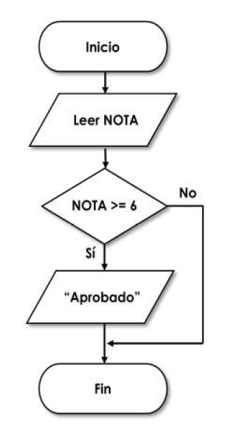
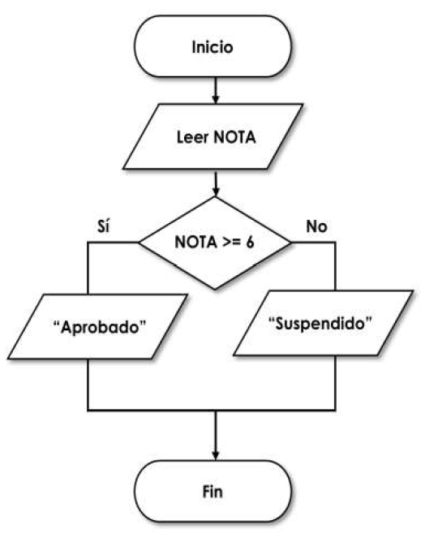
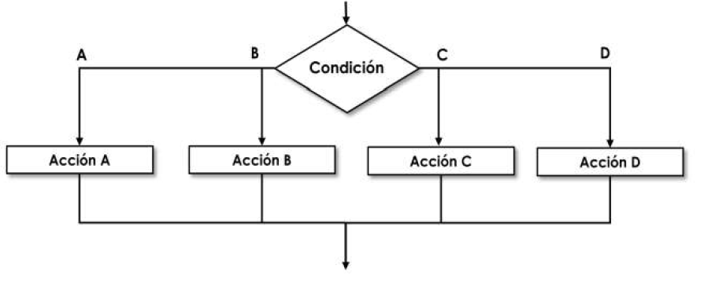
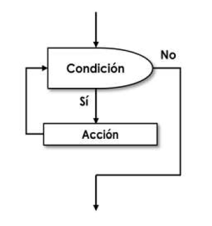

# Control de Flujo

## Sistema de notación

* Antes de lanzarse a escribir una sola línea de código es necesario pensar en la resolución del problema tal y como se ha indicado.
* La creación de una solución a un problema siguiendo un conjunto de instrucciones se denomina algoritmo.
* Es necesario invertir el tiempo suficiente para construir ese algoritmo ya que esa será la solución que se debe implementar en código.
* Existen varios sistemas de representación para describir esos algoritmos; **pseudocódigo**, la descripción narrada o diagramas **Nassi-Shneiderman**, pero en este manual se ha optado por **los diagramas de flujo** ya que resultan más intuitivos.

### Diagramas de flujo

* Los diagramas de flujo o flujogramas son la representación gráfica de la solución algorítmica de un problema.
* Para diseñarlos se emplean figuras normalizadas que representan una acción dentro del procedimiento.
* Cada una de estas figuras representa un paso a seguir dentro del algoritmo.

!!! note "NOTA"
    * Para su construcción se han de respetar las siguientes reglas:
        1. Tiene un elemento de inicio en la parte superior y uno final en la parte inferior.
        2. Se escribe de arriba hacia abajo y de izquierda a derecha.
        3. Siempre se usan flechas verticales u horizontales, jamás curvas u oblicuas
        4. Se debe evitar cruce de flujos.
        5. En cada paso expresar una acción concreta.

En la siguiente figura se puede observar **simbología** para diseñar diagramas de flujo.

<figure>
  
  <figcaption>Simbología diagramas.</figcaption>
</figure>

## Estructuras

* Controlar el flujo es determinar el orden en el que se ejecutarán las instrucciones en un programa.
* Si no existiese las estructuras de control del flujo, todo el código se ejecutarían de forma secuencial, es decir, empezarían por la primera instrucción y se ejecutarían una a una hasta llegar a la última.
* Este modo de ejecución esta realizado por **estructuras secuenciales**. Ejemplo:

<figure>
  
  <figcaption>Estructura secuencial.</figcaption>
</figure>

!!! warning
    La estructura secuencial no es válida para solucionar la mayoría de los problemas que se plantean.

* Para ello es necesario la elección de un código u otro en función de ciertas condiciones, formado otro tipo de estructuras que son conocidas como **estructuras condicionales**; entre las cuales podemos destacar:
    1. **Estructuras Alternativas**, según si se cumple la condición o no, se realizará una tarea u otra.
        * Ejemplo de utilización con la sentencia: **if**.
    2. **Estructuras Iterativas**, cuando necesario ejecutar algunas instrucciones repetidas veces.
        * Ejemplo de utilización con la sentencia: **for**.

### Estructuras alternativas

* Las estructuras de selección permiten ejecutar diferentes instrucciones dependiendo del valor de una variable o expresión.
* También se les llama ramificaciones, estructuras de decisión o alternativas.
* Cuando se usan, no todas las instrucciones del programa se ejecutan, solo las especificadas para el valor de la variable durante esa ejecución.
* Las estructuras de selección más comunes son las que proporcionan ramificaciones dobles (**if**) y múltiples (**elif** y **case**).

#### Estructura alternativa doble: **if**

* La forma general de la orden **if** es:

``` bash
if [ expresión ]
then
    realizar este código si expresión es verdadera
fi
```

<figure>
  
  <figcaption>Estructura alternativa simple.</figcaption>
</figure>

* Ejemplo: 
``` bash
if [ $# -eq 1 ]
then
    VAR=$1
fi
```

!!! info
    El código anterior comprueba se ha pasado algún argumento ,es decir, si han pasado un parámetro. En caso afirmativo, asigna el contenido de ese parámetro a la variable VAR.

!!! warning
    Hay que recordar siempre cerrar esta estructura para indicarle al terminal donde termina, en este caso, se cierra con la palabra reservada **fi**.

#### Estructura alternativa multiple if then else

* En este caso se contempla también la posibilidad de ejecutar alguna acción si no se cumple la expresión.
* La forma general del **if then else** es:

``` bash
if [ expresión ]
then
    realizar si expresión es verdadera
else
    realizar si expresión es falsa
fi
```

<figure>
  
  <figcaption>Estructura alternativa doble.</figcaption>
</figure>

* Ejemplo: 
``` bash
if [ $a -gt $b ]
then
    echo "$a es mayor que $b"
else
    echo "$a es menor que $b"
fi
```

#### La estructura if then elif else

* Permite una segunda evaluación para ejecutar código a través de la estructura **elif**.
* Es posible colocar tantos elif como condiciones se requiera evaluar.
* La forma general del **if then elif else** es:

``` bash
if [ exp1 ]
then
    realizar si exp1 es verdadera
elif [ exp2 ]
    then
    realizar si exp1 es falsa, pero es verdadera exp2
elif [ exp3 ]
then
    realizar si exp1 y exp2 son falsas, pero es verdadera exp3
else
    realizar si todas las expresiones son falsas
fi
```

* Ejemplo: 
``` bash
if [ $a -gt $b ]
then
    echo "$a es mayor que $b"
elif [ $a -eq $b ]
then
    echo "$a es igual que $b"
else
    echo "$a es menor que $b"
fi
```

!!! info
    Este ejemplo amplía el anterior comprobando si, además, los valores de a y b son iguales.

!!! warning
    El último caso se realiza con la sentencia **else**.

#### La estructura case

* La estructura case permite realizar varias acciones en función del valor de una variable.
* La limitación que tan sólo se comprueba si es igual a ese valor.
* La forma general del **case** es:

``` bash
case VARIABLE in
    valor1)
        Se ejecuta si VARIABLE tiene el valor1
        ;;
    valor2)
        Se ejecuta si VARIABLE tiene el valor2
        ;;
    *)
        Se ejecuta por defecto
        ;;
esac
```
<figure>
  
  <figcaption>Estructura Alternativa Multiple.</figcaption>
</figure>

### Estructuras de iteración

* Son operaciones que se deben ejecutar un número repetido de veces para resolver un problema.
* El conjunto de instrucciones que se ejecuta dentro de esta estructura, se denomina ciclo, bucle o lazo.
* `Iteración` es cada una de las pasadas o ejecuciones de todas las instrucciones contenidas en el bucle.
* Estas repeticiones de código van a depender de la evaluación de una condición o del valor de una variable.
* Es posible repetir un código hasta que se cumpla o deje de cumplir una condición pero también se posible la repetición tantas veces como indique una variable.

!!! warning
    Hay que tener mucho cuidado a la hora de diseñar estas estructuras y no caer en el error de construir **bucles infinitos**, es decir, estructuras que nunca dejarán de ejecutarse ya que no tienen condición de salida o, si la tienen, ésta nunca se va a cumplir.

* Para utilizar esta estructura en algoritmos, se usan:

1. **Contador:** es una variable cuyo valor se incrementa o decrementa en una cantidad constante cada vez que se produce un determinado suceso o acción. Los contadores se utilizan con la finalidad de contar sucesos o acciones internas de un bucle.

!!! info "NOTA"
    La inicialización consiste en asignarle al contador un valor. Se situará antes y fuera del bucle.

2. **Acumulador o Totalizador** es una variable que suma sobre sí misma un conjunto de valores para de esta manera tener el total de todos ellos en una sola variable.

!!! info "NOTA"
    La diferencia entre un contador y un acumulador es que mientras el primero va aumentando de uno en uno, el acumulador va aumentando en una cantidad variable.

3. **Banderas**, conocidas también como interruptores, switch, flags o conmutadores. Son variables que pueden tomar solamente dos valores durante la ejecución del programa, los cuales pueden ser **cero o uno**, o bien los valores **booleanos verdadero o falso**.

!!! info "NOTA"
    Se les suele llamar interruptores porque cuando toman un valor están simulando un interruptor abierto/cerrado o encendido/apagado.

<figure>
  
  <figcaption>Estructura Iterativa.</figcaption>
</figure>

#### Las estructuras while y until

Estas estructuras van a repetir el código que contienen mientras la expresión evaluada sea verdadera. Funcionamiento:

* Evalúa la condición, si es falsa, no realiza ninguna acción y continua con el siguiente código del programa.
* Si es verdadera entra en el bucle y ejecuta el código que contiene.
* Al finalizar la ejecución, al iterar, vuelve a evaluar la condición y vuelve a repetir la operación anterior.

!!! warning
    Al construir una estructura while es preciso asegurarse que en algún momento de su ejecución la condición dejará de cumplirse y se romperá el ciclo, si no, éste será infinito, a menos que el usuario o el sistema interrumpa su ejecución.

* `WHILE`
``` bash
while [ expresión ]
do
    código se repite MIENTRAS la expresión sea verdadera
done
```

* `UNTIL`
``` bash
until [ expresión ]
do
    código se repite HASTA que la expresión sea verdadera
done
```

!!! info
    La diferencia es que un `until` se ejecuta como mínimo una vez, ya que ejecuta el código y luego comprueba, mientras que el `while` es posible que nunca se ejecute, ya que es posible que la condición de entrada nunca se cumpla.

* Ejemplo:

``` bash
#! /bin/bash
read -p "Escribe un número: " num
i=1
while [ $i -le 10 ]
do
    let res=num*i
    echo "$i x $num = $res"
    let i=i+1
done
```
!!! info
    Este código imprime por pantalla la tabla de multiplicar del número que el usuario ha especificado. Las líneas contenidas entre `do` y `done` se ejecutarán mientras i sea menor o igual a diez. Al final de cada iteración el valor de i se incrementa en uno (es un contador) por lo que en diez iteraciones la condición dejará de cumplirse y el bucle se romperá.

#### La estructuras for

* Esta estructura permite repetir código por cada elemento de un conjunto determinado.
* No necesita condición de salida ya que al finalizar los elementos del conjunto acabará con su ejecución.
* la forma general es:

``` bash
for variable in conjunto
do
    estas líneas se repiten una vez por cada elemento del conjunto
    variable toma los valores del conjunto, uno en cada iteración
done
```
* Ejemplo:

``` bash
#! /bin/bash
read -p “Escribe la dirección de una carpeta: “ car
for i in $(ls $car)
do
    if [ -f $i ]
    then
        echo “$i es un archivo de tipo regular”
    elif [ -d $i ]
    then
        echo “$i es un archivo de tipo directorio”
    else
        echo “$i es otro tipo de archivo o no existe”
    fi
done
```
!!! info "NOTA"
    Este ejemplo se van a mostrar los nombres de los ficheros que contiene un directorio y dirá si es un directorio o un fichero.

##### Romper un bucle de forma deliberada

No sólo es posible terminar un bucle cuando se cumpla una condición o cuando se terminen los elementos de un conjunto, shell script proporciona dos formas de alterar el funcionamiento de la estructura en un bucle y romperla en función de las necesidades del programa:

1. `break` rompe el bucle que lo contiene y continúa la ejecución del script.
2. `continue` rompe la iteración que lo contiene, pero mantiene el bucle, que continuará con la siguiente iteración hasta que termine su ejecución.
3. `exit` detiene la ejecución del script. Este comando no es exclusivo de las estructuras iterativas, pero cobra especial sentido en este ámbito.

## Actividades

!!! note
    Escribe el código de los scripts en **ShellScript** que se detallan en cada ejercicio. Deberás crear un fichero de texto para cada ejercicio con el siguiente nombre: ejXXX.sh, donde las X representan el número de ejercicio. Una vez terminada la práctica, comprime todos estos ficheros en uno y súbelos al Moodle.

109. Crea un shell script que al ejecutarlo muestre por pantalla uno de estos mensajes **“Buenos días”**, **“Buenas tardes”** o **“Buenas noches”**, en función de la hora que sea en el sistema (de 8:00 de la mañana a 15:00 será mañana, de 15:00 a 20:00 será tarde y el resto será noche). Para obtener la hora del sistema utiliza el comando date.

110. Construye un programa denominado AGENDA que permita mediante un menú, el mantenimiento de un pequeño archivo lista.txt con el nombre, dirección y teléfono de varias personas. Debes incluir estas opciones al programa:
    * **Añadir** (añadir un registro)
    * **Buscar** (buscar entradas por nombre, dirección o teléfono)
    * **Listar** (visualizar todo el archivo).
    * **Ordenar** (ordenar los registros alfabéticamente).
    * **Borrar** (borrar el archivo).

111. Crea un shell script que sume los números del 1 al 1000 mediante una estructura `for`, `while` y `until`.