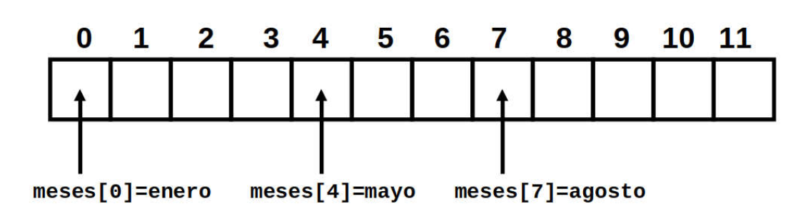

# Vectores y Funciones

## Vectores en shell script

* Un vector es una estructura de datos que permite almacenar una colección de elementos.
* Por el hecho de tratarse de una estructura de datos es posible realizar operaciones sobre él como buscar, eliminar y agregar elementos a su estructura.
* Los elementos se encuentran ordenados en función de como han sido introducidos en la estructura.
* Para acceder a cada elemento será necesario especificar la posición que ocupan dentro de ella, teniendo presente que la numeración de los vectores comienza desde cero, no desde uno.

!!! info
    Un buen ejemplo de uso sería, recoger el listado de archivos que hay en una carpeta.

<figure>
  
  <figcaption>Esquema de un vector de doce elementos.</figcaption>
</figure>

Para definir un vector disponemos de dos formas:

1. **Implícita:** hace referencia a que el vector ha sido declarado y al mismo tiempo se han inicializado sus valores.
2. **Explícitamente:** cuando el vector no requiere que se inicialice mientras se declara, es decir, pueden ser inicializados con posterioridad.

Para declarar un vector hay que utilizar la siguiente estructura:

``` bash
declare -a meses=("enero" "febrero" "marzo")
```

También es posible utilizar alguna expresión para completar un vector, como con el operador rango ...

``` bash
declare -a letras=( {N..Z} {s..z} )
echo ${letras[*]}
```

!!! info
    * Esto creará un vector con el siguiente contenido y lo mostrará por pantalla así:
    * N O P Q R S T U V W X Y Z s t u v w x y z

* Para añadir un elemento a la estructura se debe indicar el índice o posición que ocupará el nuevo dato.
* Si el índice es mayor que la última posición de la estructura, se escribirá al final de la misma.
* Si se usa un índice que ya contiene un dato, éste será sobrescrito.

``` bash
meses[3]="abril"
```

* Para mostrar el contenido del vector:

``` bash
echo ${meses[*]}
```

!!! info
    Mostrará: 
    enero febrero marzo abril

* Es buena idea conocer el número de elementos que contiene un vector para poder introducir datos de forma correcta y no sobrescribir por accidente algún valor ya almacenado. Así es posible utilizar:

| Comando | Acción |  
|:-----:|------------------------------------------------|
| `${meses[*]}` | Muestra todos los valores del vector|
| `${!meses[*]}` | Muestra todos los índices del vector|
| `${#meses[*]}` | Devuelve el número de valores del vector|
| `${#meses[0]}` | Imprime la longitud del primer dato del vector|

* Para recorrer los valores que contiene esta estructura se puede utilizar un bucle **for**

``` bash
for item in ${meses[*]}
do
    echo $item
done
```
* También se puede utilizar sus índices para mostrar los datos contenidos.

``` bash
for index in ${!meses[*]}
do
    echo ${meses[$index]}
done
```

* Es una estructura muy útil en la que se puede guardar cualquier tipo de información, como por ejemplo los ficheros que contiene una carpeta:

``` bash
i=0;
for fichero in $(ls -a)
do
    ficheros[$i]=$fichero;
    let i=i+1;
done
```

## Funciones en shell script

* Una función es un conjunto de líneas de código que se distinguen a través de un identificador y que se ejecutan al invocar ese identificador.
* Se podría definir como un shell script dentro de un shell script.
* Sirve para organizarlo en unidades lógicas más pequeñas de manera que sea más fácil mantenerlo.
* Las funciones aceptan parámetros, de idéntica manera que los shell script, por lo que su uso también es muy intuitivo.
* La estructura de una función queda definida de la siguiente manera:

``` bash
function nombre_función(){
    código que se ejecutará al llamar a la función
}
```

!!! info
    * `source`
    * Para incluir el código de un fichero en otro tan sólo será necesario utilizar la palabra source seguida de la ruta de ese fichero. * * También es posible usar el punto para poder cargarlo:
    * `source funciones.sh` o `./funciones.sh`

* Las funciones suelen declararse al inicio del documento y luego utilizadas a lo largo del programa.
* Uno de los objetivos es optimizar el código, mediante el "aprovechamiento" de código. Cuando un conjunto de líneas de código se repiten, es posible agruparlas bajo un nombre y utilizar ese nombre en lugar de repetir este código.

* Ejemplo:

``` bash
#! /bin/bash
function imprimir_tabla(){
    echo “Tabla del número $1”
    for i in 1 2 3 4 5 6 7 8 9 10
    do
        let res=$1*i
    echo “$i x $1 = $res”
    done
}
read -p “Escribe un número: “ num
imprimir_tabla $num
imprimir_tabla 5
```

* En este ejemplo se ha construido una función para imprimir la tabla de multiplicar de un número pasado como parámetro.
* En la siguiente línea le pedimos al programa que imprima la tabla del número cinco.
* No se ha necesitado escribir el código que imprime la su tabla de multiplicar de nuevo, ya que con invocar el nombre de la función el programa ya sabe que código debe ejecutar.

!!! warning
    * Nótese que el valor de `$1` no se pasa como parámetro del shell script, si no como parámetro a la función imprimir_tabla tras haberlo preguntado al usuario.
    * Hay que tener en cuenta que las variables que se declaran dentro de una función existen únicamente dentro de ella. Si es preciso utilizar una variable fuera de una función se puede usar `return`, que devuelve un valor fuera de ella, o usar la palabra reservada `GLOBAL`
    * Es preferible utilizar el primer método para que devuelva un valor que será recogido en otra variable fuera de la función que lo originó.

## Actividades

!!! note
    Escribe el código de los scripts en **ShellScript** que se detallan en cada ejercicio. Deberás crear un fichero de texto para cada ejercicio con el siguiente nombre: ejXXX.sh, donde las X representan el número de ejercicio. Una vez terminada la práctica, comprime todos estos ficheros en uno y súbelos al Moodle.

112. Realiza un script utilizando funciones que permita crear un informe de las **IP libres** en la red en la que se encuentra el equipo. Debe contener las siguientes opciones:
    1. El informe contendrá un **listado de todas las IP de la red** a la que pertenece el equipo indicando si está libe o no (usa el comando ping).
    2. En el informe debe aparecer el **tipo de red** (rango CIDR) en el que está inmerso el ordenador con el **nombre de la red**, su **broadcast** y su **máscara de subred**. Esta información la podéis obtener desde el comando ifconfig.

!!! note
    Para facilitar los cálculos asumimos que el equipo donde se ejecuta el script se encuentra en una única red, es decir, solo posee una tarjeta de red.

113. Crea un script que rellene un **vector** con cien valores aleatorios y muestre en pantalla en una sola línea los valores generados.

114. Genera un script que rellene un **vector** con diez números pedidos al usuario y que los muestre por pantalla de la siguiente forma:
    1. en orden inverso a como han sido introducidos los valores
    2. los valores ordenados de menor a mayor en una sola línea
    3. los valores ordenados de mayor a menor en una sola línea
    4. la suma total de sus valores
    5. cantidad de valores pares que contiene el vector
    6. la suma total de números impares
    7. la media aritmética de los valores que contiene el vector

114. Crea un script que muestre las opciones del ejercicio anterior con select. El usuario introducirá los valores del **vector** al iniciar el script. Cuando termine aparecerá el menú de selección (deberás añadir la opción para salir del script). Además deberás crear una **función** para cada opción del menú y llamarla en cada una de las opciones del select.