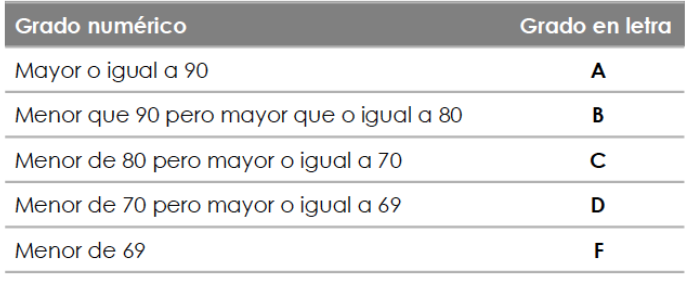

# Prueba Específica

Esta prueba consta de dos partes:

- Una primera parte con **preguntas tipo test**, con carácter teórico, con un peso del **30%** en el total de la prueba.
- La segunda parte consta de ejercicios prácticos basados en los realizados durante la Unidad Didáctica, con un valor del **70%** del total.

## Test:

1. En shell Script para poder interactuar con un programa de terminal es necesario disponer de un mecanismo de entrada y salida de datos, en este sentido se utilizan los siguientes comandos:
    1. listen/echo
    2. listen/write
    3. read/echo
    4. read/write

2. ¿Qué es un Script?
    1. Es un archivo de texto que contiene una serie de comandos que, ordenados de forma específica, realizan la tarea para la que fueron diseñados.
    2. Conjunto de especificaciones que se le hacen al programa al momento de llamarlo para obtener un efecto diferente.
    3. Es un parámetro que cambia su valor durante la ejecución del programa.
    4. Ninguna de las anteriores.

3. El comando echo...
    1. Su tarea es la de mostrar información con mensajes de texto lanzados por pantalla.
    2. Esta herramienta asigna el texto que el usuario ha escrito en el terminal y a una o más variables.
    3. Este comando toma los argumentos dados como expresiones numéricas, los evalúa e imprime el resultado.
    4. Ninguna de las anteriores.

4. Una Tubería ...
    1. Una Redirección consiste en trasladar la información de un fichero de dispositivo a otro.
    2. Es la forma práctica de redireccionar la salida estándar de un programa hacia la entrada estándar de otro.
    3. Es un comando que se ejecuta desde un terminal que permite configurar vínculos entre varios comandos.
    4. Ninguna de las anteriores.

5. Los scripts de Shell son uno de los tipos de programas más habituales en todos los sistemas LINUX/GNU. **#!/bin/bash** en la primera línea del shell script indica:
    1. Cambia el directorio a /bin/bash.
    2. Indica que se debe usar la shell bash para ejecutar el script.
    3. Ejecuta el comando /bin/bash y presenta el resultado en pantalla.
    4. Es un comentario que no indica nada.

6. ¿Qué es una variable?
    1. Es un archivo de texto que contiene una serie de comandos que, ordenados de forma específica, realizan la tarea para la que fueron diseñados.
    2. Conjunto de especificaciones que se le hacen al programa al momento de llamarlo para obtener un efecto diferente.
    3. Es un parámetro que cambia su valor durante la ejecución del programa.
    4. Ninguna de las anteriores.

7. Una Redirección ...
    1. Una Redirección consiste en trasladar la información de un fichero de dispositivo a otro.
    2. Es la forma práctica de redireccionar la salida estándar de un programa hacia la entrada estándar de otro.
    3. Es un comando que se ejecuta desde un terminal que permite configurar vínculos entre varios comandos.
    4. Ninguna de las anteriores.

8. ¿Qué es un Argumento o parámetro?
    1. Es un archivo de texto que contiene una serie de comandos que, ordenados de forma específica, realizan la tarea para la que fueron diseñados.
    2. Conjunto de especificaciones que se le hacen al programa al momento de llamarlo para obtener un efecto diferente.
    3. Es un parámetro que cambia su valor durante la ejecución del programa.
    4. Ninguna de las anteriores.

9. El comando read...
    1. Su tarea es la de mostrar información con mensajes de texto lanzados por pantalla.
    2. Esta herramienta asigna el texto que el usuario ha escrito en el terminal y a una o más variables.
    3. Este comando toma los argumentos dados como expresiones numéricas, los evalúa e imprime el resultado.
    4. Ninguna de las anteriores.

10. El comando expr...
    1. Su tarea es la de mostrar información con mensajes de texto lanzados por pantalla.
    2. Esta herramienta asigna el texto que el usuario ha escrito en el terminal y a una o más variables.
    3. Este comando toma los argumentos dados como expresiones numéricas, los evalúa e imprime el resultado.
    4. Ninguna de las anteriores.

11. ¿Qué hace el siguiente script adjunto?
    1. Muestra por pantalla 10
    2. Muestra por pantalla 7+3
    3. Muestra por pantalla 73
    4. Ninguna de las anteriores.

``` yaml
#! /bin/bash
num1=7
num2=3
let resultado=num1+num2
echo "$resultado"
```

12. ¿Qué hace el siguiente script adjunto?
    1. Muestra por pantalla la tabla de multiplicar del número introducido por el usuario.
    2. Muestra por pantalla la tabla de multiplicar de la variable num.
    3. Muestra por pantalla la tabla de multiplicar de la variable i.
    4. a y b son verdaderas.

``` yaml
#! /bin/bash
read -p “Escribe un número: “ num
i=1
while [ $i -le 10 ]
do
    let res=num*i
    echo “$i x $num = $res”
    let i=i+1
done
```

13. Diagramas de Flujo ...
    1. Son operaciones que se deben ejecutar un número repetido de veces para resolver un problema.
    2. Es la representación gráfica de la solución algorítmica de un problema.
    3. Permiten ejecutar diferentes instrucciones dependiendo del valor de una variable o expresión.
    4. Es determinar el orden en el que se ejecutarán las instrucciones en un programa

14. ¿Qué hace el siguiente script adjunto?
    1. Muestra por pantalla 10
    2. Muestra por pantalla 7+3
    3. Muestra por pantalla 73
    4. Ninguna de las anteriores.

``` yaml
#! /bin/bash
num1=7
num2=3
let resultado=num1+num2
echo "$num1" + "$num2"
```

15. Diagramas de Flujo ...
    1. Es la representación gráfica de la solución algorítmica de un problema.
    2. Permiten ejecutar diferentes instrucciones dependiendo del valor de una variable o expresión.
    3. Son operaciones que se deben ejecutar un número repetido de veces para resolver un problema.
    4. Es determinar el orden en el que se ejecutarán las instrucciones en un programa

16. Estructuras condicionales ...
    1. Es la representación gráfica de la solución algorítmica de un problema.
    2. Permiten ejecutar diferentes instrucciones dependiendo del valor de una variable o expresión.
    3. Son operaciones que se deben ejecutar un número repetido de veces para resolver un problema.
    4. Es determinar el orden en el que se ejecutarán las instrucciones en un programa

17. ¿Qué hace el siguiente script adjunto?
    1. Muestra por pantalla la tabla de multiplicar el parámetro 1 introducido al ejecutar el script.
    2. Muestra por pantalla la tabla de multiplicar del argumento $1.
    3. Muestra por pantalla la tabla de multiplicar de la variable i.
    4. a y b son verdaderas.

``` yaml
#! /bin/bash
echo “Tabla del número $1”
    for i in 1 2 3 4 5 6 7 8 9 10
    do
        let res=$1*i
    echo “$i x $1 = $res”
    done
```

18. ¿Qué hace el siguiente script adjunto?
    1. Muestra por pantalla 10
    2. Muestra por pantalla 7+3
    3. Muestra por pantalla 73
    4. Ninguna de las anteriores.

``` yaml
#! /bin/bash
num1=7
num2=3
let resultado=num1+num2
echo "$num1+$num2"
```

19. Estructuras iterativas ...
    1. Es la representación gráfica de la solución algorítmica de un problema.
    2. Permiten ejecutar diferentes instrucciones dependiendo del valor de una variable o expresión.
    3. Son operaciones que se deben ejecutar un número repetido de veces para resolver un problema.
    4. Es determinar el orden en el que se ejecutarán las instrucciones en un programa.

20. ¿Qué hace el siguiente script adjunto?
    1. Muestra por pantalla 10
    2. Muestra por pantalla 7+3
    3. Muestra por pantalla 73
    4. Ninguna de las anteriores.

``` yaml
#! /bin/bash
num1=7
num2=3
let resultado=num1+num2
echo "$num1""$num2"
```

## Práctica

1. Escribe un shell script que pida al usuario tres números y los muestre ordenados de mayor a menor.
2. Realiza un shell script que a partir de una fecha introducida por teclado con el formato DÍA, MES, AÑO, se obtenga la fecha del día siguiente.
3. Crea un shell script que acepte una calificación numérica y visualice la correspondiente en letra, según la figura adjunta. Se deberá comprobar que los datos introducidos por el usuario son válidos.

<figure>
  
</figure>

4. Escribe un shell script que genere dos vectores de quince elementos cada uno y los rellene con número aleatorios comprendidos entre 0 y 100. Después sume esas dos estructuras y muestre los tres vectores por pantalla. 

- Para ello crea las funciones **imprimir_array(array_a_imprimir)** y **sumar_array(array1, array2)**.