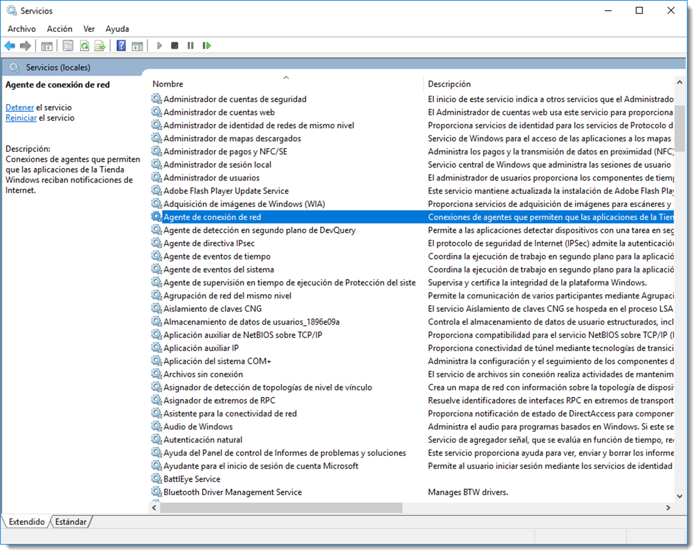
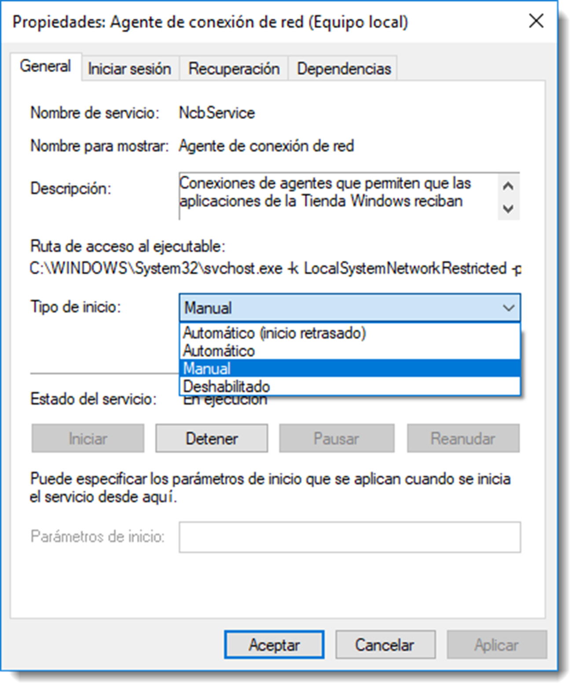
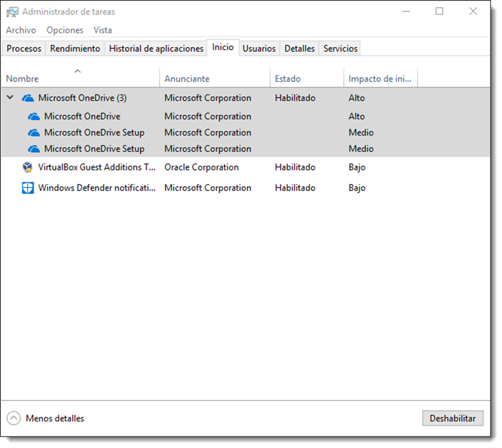

# Gestión de los servicios y demonios

Para que el sistema operativo realice su trabajo, en ocasiones es necesario que disponga de programas que se ejecutan en segundo plano gestionando un recurso. Estos programas, conocidos como servicios o demonios en el entorno GNU/Linux, se mantienen a la espera a que algún proceso solicite uno de los servicios que ofrece. Por ejemplo, el servicio de red se sitúa entre la NIC y el proceso que necesite salir a Internet. En la mayoría de ocasiones, estos programas se ejecutan durante la carga del sistema operativo y son fundamentales para la gestión de los recursos que ofrece el sistema operativo, ya sean hardware o software.

Los sistemas operativos de Microsoft disponen de una herramienta gráfica para la gestión de los servicios. Se accede a ella en <span class="menu">Inicio </span> → <span class="menu">Herramientas administrativas</span> → <span class="menu">Servicios</span> o escribiendo la palabra servicio en el buscador.



Cada uno de estos servicios puede configurarse de cuatro formas diferentes:

- **Deshabilitado**, no es posible iniciar el servicio a través de otro servicio
- **Manual**, no se inicia con el sistema, debe ser arrancado de forma manual
- **Automático**, se inicia durante el proceso de arranque del sistema.
- **Automático** (inicio retrasado), se inicia después de que todos los servicios del sistema se hayan cargado en memoria principal.

A través de esta herramienta será posible controlar el estado del servicio, el fichero ejecutable que lo inicia, sus dependencias si las tuviera o qué acciones hay que realizar si el servicio fallase durante su inicio.

Además de este completo software, Microsoft Windows 10 Professional dispone de una utilidad para la gestión de los servicios de inicio retrasado, aquellos que se inician cuando todos los servicios del sistema han sido cargados en memoria principal. Estos servicios suelen estar asociados a software instalado con posterioridad al sistema y que ejecutan una tarea muy específica. A través de la pestaña Inicio de la herramienta Administrador de tareas se controlan este tipo de servicios, aunque también es posible realizar esta configuración desde la herramienta anterior.





En los sistemas operativos basados en **GNU/Linux** se dispone de varias herramientas basadas en CLI para realizar la administración de servicios, denominados demonios en terminología Unix. Cuando se configura un demonio en GNU/Linux se crean scripts para controlar su carga y descarga de memoria principal.

Hay diferentes sistemas de arranque según la distribución (init System V, upstart, launchd en macOS), pero **systemd** es el que se está imponiendo en casi todas ellas. En systemd el concepto de nivel de ejecución existe solo por compatibilidad; hoy se trabaja con objetivos (targets) y servicios que se activan de forma declarativa. En Ubuntu también se usa systemd.

## Unidades objetivo y servicios

El componente básico de systemd es la unidad o unit. Existen varias: servicios, sockets, periféricos, objetivos, etc. Un **objetivo** es básicamente el punto de sincronización entre unidades en espera. De este modo, dispondrá, por ejemplo, de unidades objetivo correspondientes a cada nivel de ejecución, pero puede llamarlas como quieras.

Las objetivos o los servicios que deben ser gestionados por el sistema durante el arranque están en `/etc/systemd/system`, en forma de enlaces simbólicos o copias. El catálogo de unidades proviene de `/lib/systemd/system`.

Los servicios acaban con el sufijo **.service**. Vamos a ver el contenidos de estos ficheros:

```bash title="contenido de ficheros.service"
/etc/systemd/system$ cat syslog.service
[Unit]
Description=System Logging Service
Requires=syslog.socket
Documentation=man:rsyslogd(8)
Documentation=https://www.rsyslog.com/doc/

[Service]
Type=notify
ExecStart=/usr/sbin/rsyslogd -n -iNONE
StandardOutput=null
Restart=on-failure

# Increase the default a bit in order to allow many simultaneous
# files to be monitored, we might need a lot of fds.
LimitNOFILE=16384

[Install]
WantedBy=multi-user.target
Alias=syslog.service


```

Si nos fijamos en la linea que tiene de **WantedBy**. Sirve para indicar que este servicio es necesario para el objetivo **multi-user.target** (lo que correspondrá por ejemplo al nivel 3 del init System V)

Ahora vamos a ver el fichero .target de un objetivo.

```bash title="Fichero .target"
cat poweroff.target
#  SPDX-License-Identifier: LGPL-2.1+
#
#  This file is part of systemd.
#
#  systemd is free software; you can redistribute it and/or modify it
#  under the terms of the GNU Lesser General Public License as published by
#  the Free Software Foundation; either version 2.1 of the License, or
#  (at your option) any later version.

[Unit]
Description=Power-Off
Documentation=man:systemd.special(7)
DefaultDependencies=no
Requires=systemd-poweroff.service
After=systemd-poweroff.service
AllowIsolate=yes
JobTimeoutSec=30min
JobTimeoutAction=poweroff-force

[Install]
Alias=ctrl-alt-del.target


```

Nos fijamos en **Requires** y **After**. En este objetivo requiere (Requires) de un servicio en concreto y su ejecución después de la unidad que pone (After).

## Acciones

El comando `systemctl` permite controlar la ejecución de servicios.

```bash title="Ejemplo, listado de unidades"

systemctl
  UNIT                                                                                      LOAD   ACTIVE     SUB       JOB   DESCRIPTION                    >
  proc-sys-fs-binfmt_misc.automount                                                         loaded active     running         Arbitrary Executable File Forma>
  sys-bus-pci-drivers-nvidia.device                                                         loaded active     plugged         /sys/bus/pci/drivers/nvidia    >
  sys-devices-pci0000:00-0000:00:02.0-drm-card0-card0\x2deDP\x2d1-intel_backlight.device    loaded active     plugged         /sys/devices/pci0000:00/0000:00>
  sys-devices-pci0000:00-0000:00:14.0-usb1-1\x2d14-1\x2d14:1.0-bluetooth-hci0.device        loaded active     plugged         /sys/devices/pci0000:00/0000:00>
  sys-devices-pci0000:00-0000:00:14.3-net-wlp0s20f3.device

```

```bash title="Ejemplo, acciones de systemctl"
# Parada y reinicio de unidades
systemctl stop cups.service
systemctl start cups.service
systemctl restart cups.service
systemctl reload cups.service

# Consulta de estado con logs recientes
systemctl status cups.service --no-pager
journalctl -u cups.service -n 20 --no-pager
```

El siguiente comando indica cuáles son las unidades objetivo activas:

```bash title="Ejemplo, unidades target"
systemctl list-units --type=target
  UNIT                    LOAD   ACTIVE   SUB    JOB   DESCRIPTION
  basic.target            loaded active   active       Basic System
  bluetooth.target        loaded active   active       Bluetooth
  cryptsetup.target       loaded active   active       Local Encrypted Volumes
  getty-pre.target        loaded active   active       Login Prompts (Pre)
  getty.target            loaded active   active       Login Prompts
  graphical.target        loaded inactive dead   start Graphical Interface
  local-fs-pre.target     loaded active   active       Local File Systems (Pre)
  local-fs.target         loaded active   active       Local File Systems
  multi-user.target       loaded inactive dead   start Multi-User System
  network-online.target   loaded active   active       Network is Online
  network.target          loaded active   active       Network
  nss-lookup.target       loaded active   active       Host and Network Name Lookups
  nss-user-lookup.target  loaded active   active       User and Group Name Lookups
  paths.target            loaded active   active       Paths
  remote-fs.target        loaded active   active       Remote File Systems
  slices.target           loaded active   active       Slices
  snapd.mounts-pre.target loaded active   active       Mounting snaps
  snapd.mounts.target     loaded active   active       Mounted snaps
  sockets.target          loaded active   active       Sockets
  sound.target            loaded active   active       Sound Card
  swap.target             loaded active   active       Swap
  sysinit.target          loaded active   active       System Initialization
  time-set.target         loaded active   active       System Time Set
  time-sync.target        loaded active   active       System Time Synchronized
  timers.target           loaded active   active       Timers

LOAD   = Reflects whether the unit definition was properly loaded.
ACTIVE = The high-level unit activation state, i.e. generalization of SUB.
SUB    = The low-level unit activation state, values depend on unit type.
JOB    = Pending job for the unit.

25 loaded units listed. Pass --all to see loaded but inactive units, too.
To show all installed unit files use 'systemctl list-unit-files'.

```

## Ejemplo práctico paso a paso: nginx

1. Instala nginx desde repositorios:

```
sudo apt update
sudo apt install nginx
```

2. Comprueba estado y puerto:

```
systemctl status nginx
ss -tnlp | grep nginx
```

3. Deshabilita el arranque automático:

```
sudo systemctl disable nginx
```

4. (Opcional) Override de servicio:

```
sudo systemctl edit nginx
```

Añade en `/etc/systemd/system/nginx.service.d/override.conf`:

```
[Service]
ExecStart=
ExecStart=/usr/sbin/nginx -g 'daemon off;' -c /etc/nginx/nginx.conf
```

5. Recarga y valida:

```
sudo systemctl daemon-reload
sudo systemctl stop nginx
sudo systemctl status nginx
```

Este flujo cubre lo pedido en la Actividad de nginx en LXD (detener y evitar arranque).

## Otros comandos útiles de systemd (Ubuntu)

- Mapear targets vs runlevels: `systemctl list-units --type=target` y `systemctl get-default`.
- Ver dependencias y tiempos de arranque: `systemd-analyze blame` y `systemd-analyze critical-chain`.
- Ver unidades y su estado habilitado/deshabilitado: `systemctl list-unit-files --type=service`.
- Ver contenido efectivo de una unidad y sus drop-ins: `systemctl cat nginx`.
- Crear overrides sin tocar el fichero original: `sudo systemctl edit nginx` genera `/etc/systemd/system/nginx.service.d/override.conf`.
- Forzar recarga de definiciones tras cambios: `sudo systemctl daemon-reload`.
- Logs: `journalctl -u nombre.service --since "-10m"` (añade `-f` para seguir en tiempo real). En Ubuntu el journal persiste si se habilita `/var/log/journal` (directorio creado y permisos correctos).
