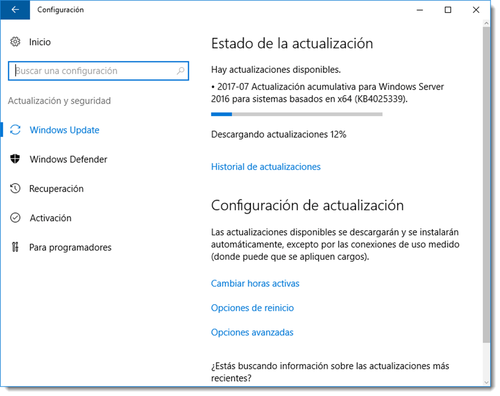

# Actualización de sistemas operativos. Parches de seguridad

Mantener al día el software del sistema informático es fundamental para su buen funcionamiento y seguridad. Es evidente que no todo el software tiene la misma prioridad y son los sistemas operativos lo que deben ir por delante en cuestiones de actualización.

Las tareas de actualización y seguridad son similares en ambos tipos de sistemas operativos, pero se prestará especial atención a los SOR.

En la familia de Windows todos los sistemas operativos poseen una herramienta que los mantiene actualizados y esa es Windows Update. Se accede a ella a través de <span class="menu">Configuración</span> → <span class="menu">Sistema</span> → <span class="menu">Actualización y Seguridad</span> → <span class="menu">Windows Update</span> y desde allí se pueden activar las actualizaciones automáticas, configurar qué actualizaciones se deben instalar, a qué hora y la opciones de reinicio si fuese necesario.


Hay que tener en cuenta que un SOR **no se puede reiniciar a la ligera,** ya que de él depende el buen funcionamiento del sistema informático. Es conveniente que exista un servidor de backup que recoja el testigo en cuanto el principal se reinicie, o realizar esta parada en un horario poco sensible.

Con más o menos diferencias, todas las versiones modernas de los sistemas operativos de Microsoft tienen habilitada esta característica por defecto. Es conveniente revisar la configuración de estas actualizaciones para dar prioridad a las que Microsoft cataloga como críticas ante cualesquieras otras.

En **Ubuntu Server** también se dispone de una herramienta similar a ésta pero que se gestiona a través del terminal. A continuación se muestra el flujo en orden para dejar activadas las actualizaciones automáticas centradas en seguridad.

### Paso 1: configurar periodicidad básica

Edita `/etc/apt/apt.conf.d/10periodic` con este contenido:

```bash title="Contenido del fichero 10periodic"
APT::Periodic::Update-Package-Lists "1";
APT::Periodic::Download-Upgradeable-Packages "0";
APT::Periodic::AutocleanInterval "7";


```

Para activar la descarga automática cambia la línea `APT::Periodic::Download-Upgradeable-Packages` a `"1"`.

### Paso 2: instalar unattended-upgrades

Separa la descarga de la instalación con la herramienta unattended-upgrades:

```bash title="Instalación de unattended-upgrades"
sudo apt-get install unattended-upgrades
```

### Paso 3: permitir solo seguridad

Tras la instalación aparece `/etc/apt/apt.conf.d/50unattended-upgrades`. Habilita únicamente el origen de seguridad:

```bash title="Contenido del fichero de configuración"
// Automatically upgrade packages from these (origin:archive) pairs
Unattended-Upgrade::Allowed-Origins {
"${distro_id}:${distro_codename}-security";
// "${distro_id}:${distro_codename}-updates";
// "${distro_id}:${distro_codename}-proposed";
// "${distro_id}:${distro_codename}-backports";
};
```

Estas líneas hacen referencia a diferentes tipos de actualizaciones. Para añadir otros orígenes, elimina `//` al inicio, pero comienza solo con seguridad.

## Comprobación y buenas prácticas

- Comprueba el estado de unattended-upgrades: `sudo systemctl status unattended-upgrades`.
- Revisa el log de ejecución: `/var/log/unattended-upgrades/unattended-upgrades.log`.
- Mantén comentadas `updates` y `backports` hasta validarlo en laboratorio.
- Planifica ventanas de mantenimiento y, en servidores críticos, configura un nodo de respaldo antes de aplicar reinicios necesarios.
