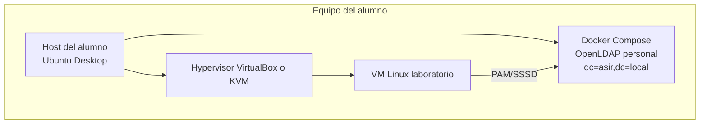

# Servicio de autenticación con Docker y máquinas virtuales por alumno

> Cada estudiante despliega su propio servidor OpenLDAP en Docker y lo usa como backend de autenticación para una máquina virtual Linux.

---

## Objetivos del laboratorio

- Reutilizar el `docker-compose` de `docs/UD3/docker-openldap.md` para que **cada alumno** levante su propio directorio LDAP, manteniendo el dominio `asir.local` y la contraseña `admin123`.
- Diseñar la red host-only o bridge necesaria para que la máquina virtual del alumno llegue al contenedor LDAP que corre en el host.
- Configurar en la VM el inicio de sesión mediante `sssd`/`pam_sss.so`, de forma que **solo existan cuentas remotas en LDAP**.
- Validar el flujo completo: alta de usuarios en LDAP → login en la VM → servicio funcionando con identidad centralizada.
- **Requisito previo**: haber completado la actividad de **TLS/StartTLS** en OpenLDAP (certificados generados y servicio verificado). Esta práctica **exige** conexión segura con certificado.

---

## Arquitectura propuesta



- El contenedor LDAP vive en la máquina física del alumno y expone el puerto `389` en el propio host (`network_mode: host` o `ports: ['389:389']`). Si se usa **LDAPS**, expón también `636`.
- La VM alcanza el servicio LDAP a través de la red Host-Only (`vboxnet0`) cuyo gateway habitual es la IP del host (`192.168.56.1`).
- Todas las altas, bajas y cambios de contraseña se realizan sobre el contenedor; la VM no almacena cuentas locales salvo `root`.

---

<!-- ## Preparación previa para el docente

- Verificar que los equipos de los alumnos disponen de **Docker**, **Docker Compose** y **VirtualBox** (o `virt-manager`+KVM).
- Entregar un paquete con:
  - Plantilla `docker-compose.yml` de OpenLDAP ya configurada con `LDAP_DOMAIN=asir.local`, `LDAP_BASE_DN=dc=asir,dc=local` y `LDAP_ADMIN_PASSWORD=admin123`.
- Ficheros LDIF ya utilizados en prácticas previas (por ejemplo, `users.ldif` con la cuenta `cn=profesor,ou=Usuarios,dc=asir,dc=local` y los alumnos ya dados de alta).
  - Script de comprobación `check-ldap.sh` (usa `ldapsearch` contra el contenedor).
- Acordar rangos de red host-only (ej. `192.168.56.0/24`) y reservar una IP por alumno para su contenedor (`ldap-alumnoX`). -->

---

## Fase 1: levantar el servidor LDAP en Docker

1. **Comprobar la red Host-Only**
      - Desde el host confirmar la existencia de `vboxnet0` y su rango (`192.168.56.0/24`).  
      - La IP del host en esa red suele ser `192.168.56.1`. Anótala porque será la referencia dentro de la VM.
2. **Personalizar `docker-compose.yml`**
    - Variables `.env` por alumno (solo cambia `LDAP_ORGANISATION` si se desea personalizar):  
      ```env
      LDAP_DOMAIN=asir.local
      LDAP_ORGANISATION=ASIR2X
      LDAP_BASE_DN=dc=asir,dc=local
      LDAP_ADMIN_PASSWORD=admin123
   
     
      ```
      - Exponer el puerto LDAP hacia el host (StartTLS por 389; si usas LDAPS, abre 636):  
      ```yaml
      services:
         openldap:
            ports:
            - "389:389"
            # Opcional si usas ldaps://
            - "636:636"
      ```
   - Solo si se necesita una red Docker aparte, usar una subred distinta a la de VirtualBox (por ejemplo `172.18.0.0/24`) y documentar el enrutamiento o el NAT que permita a la VM alcanzarla.
3. **Trabajos Iniciales**
      - Arrancar los servicios: `docker compose up -d`.
      - Importar los LDIF ya trabajados en prácticas anteriores (incluyen la cuenta `profesor` y los alumnos que cada equipo dio de alta). Si lo has realizado ya no lo tienes que volver otra vez. 
      - **Ejercicio**: aplica `ldapmodify` con `add-posix-profesor.ldif` y `ldapadd` con `add-groups-and-posixgroup.ldif` (o crea un LDIF equivalente) para actualizar `cn=profesor` y `cn=asirusers` con los atributos POSIX (`uidNumber`, `gidNumber`, `homeDirectory`, `loginShell`, `memberUid`) exigidos por el laboratorio. Dado que los usuarios y grupos tienen que seguir la norma POSIX

      ``` title="add-posix-profesor.ldif"

            dn: cn=profesor,ou=Usuarios,dc=asir,dc=local
            changetype: modify
            add: objectClass
            objectClass: posixAccount
            -
            add: uidNumber
            uidNumber: 10001
            -
            add: gidNumber
            gidNumber: 10001
            -
            add: homeDirectory
            homeDirectory: /home/profesor
            -
            add: loginShell
            loginShell: /bin/bash
      ```

      ``` title="add-posix-group.ldif" 

            dn: ou=Groups,dc=asir,dc=local
            objectClass: organizationalUnit
            ou: Groups

            dn: cn=asirusers,ou=Groups,dc=asir,dc=local
            objectClass: posixGroup
            cn: asirusers
            gidNumber: 10001

      ```

      - Realizar un `ldapsearch` conjunto para verificar que el usuario `profesor` está disponible antes de pasar a la VM.
      - **Verificación TLS**: comprueba StartTLS desde el host (debe funcionar antes de seguir):
        ```bash
        ldapsearch -x -ZZ -H ldap://192.168.56.1:389 \
          -D "cn=admin,dc=asir,dc=local" -w admin123 \
          -b "dc=asir,dc=local" "(uid=profesor)" dn
        ```

---

## Fase 2: preparación de la máquina virtual

1. **Configurar redes de la VM**
      - Adaptador 2: Host-Only `vboxnet0` (o puente interno) en `192.168.56.0/24`.
      - IP estática en la VM: `192.168.56.100/24`, gateway sin definir, DNS el del aula.
      - Adaptador 1: NAT para acceder a Internet (actualizaciones).  

!!! Warning end "Te salva la vida"
      
      - Activa la cuenta `root` y mantén toda la práctica abierta en una terminal.
      - Crea uno o varios clones de la máquina virtual antes de empezar.


       

2. **Instalar paquetes LDAP/SSSD**

      ```bash
      sudo apt update && sudo apt install sssd libnss-sss libpam-sss ldap-utils pamtester sssd-tools
      ```

   3. **Instalar el certificado de la CA en la VM**

      Copia `ca.crt` (generada en la actividad TLS/StartTLS) a la VM y confía en ella:
      ```bash
      sudo cp ca.crt /usr/local/share/ca-certificates/ldap-lab-ca.crt
      sudo update-ca-certificates
      ```

   4. **Crear `/etc/sssd/sssd.conf`**
      
      ```ini
            # Configuración global de SSSD: define qué servicios expone y contra qué dominios trabaja.
            [sssd]
            # Publicamos los conectores NSS y PAM para que el sistema pueda resolver usuarios/grupos y autenticar.
            services = nss, pam
            # Nombre lógico del dominio que gestionará SSSD (aparece en el resto de secciones).
            domains = asir
            # Nivel máximo de depuración para ver qué ocurre internamente.
            debug_level = 9

            # Sección específica del servicio NSS (resolución de identidades).
            [nss]
            # Activamos el mismo nivel de depuración para tener trazas completas al consultar usuarios/grupos.
            debug_level = 9

            # Sección del responder PAM (autenticación de usuarios).
            [pam]
            # Mantenemos el nivel de depuración alto para seguir el flujo de login con detalle.
            debug_level = 9

            # Definición del dominio LDAP que vamos a consumir.
            [domain/asir]
            # Indicamos que toda la información de identidades proviene de un servidor LDAP.
            id_provider = ldap
            # También delegamos la autenticación (bind) en LDAP.
            auth_provider = ldap
            # Permite cambiar contraseñas a través del mismo backend LDAP.
            chpass_provider = ldap
            # Guardamos en caché credenciales/entradas para poder trabajar sin conexión temporalmente.
            cache_credentials = True
            # Habilitamos la enumeración completa para que NSS pueda listar todos los usuarios/grupos.
            enumerate = True
            # Elevamos la depuración del dominio para ver cada consulta que se lanza.
            debug_level = 9

            # URL del servidor LDAP al que conectarse (protocolo, host e IP y puerto).
            ldap_uri = ldap://192.168.56.1:389
            # DN base desde el que se empezarán las búsquedas de usuarios y grupos.
            ldap_search_base = dc=asir,dc=local
            # Exigimos STARTTLS en este laboratorio (con certificado válido).
            ldap_id_use_start_tls = true
            # La CA del laboratorio se instala en el sistema (update-ca-certificates).
            ldap_tls_cacert = /etc/ssl/certs/ca-certificates.crt
            # Rechaza certificados no válidos.
            ldap_tls_reqcert = demand

            # DN y contraseña del usuario con el que SSSD consulta el directorio.
            ldap_default_bind_dn = cn=admin,dc=asir,dc=local
            ldap_default_authtok = admin123

            # Indicamos qué tipo de objetos representan a los usuarios POSIX en el árbol.
            ldap_user_object_class = posixAccount
            # Unidad organizativa donde se almacenan los usuarios.
            ldap_user_search_base = ou=Usuarios,dc=asir,dc=local
            # Atributo que se usará como nombre de usuario (login).
            ldap_user_name = uid
            # También usamos el uid como principal para UPN (si se solicita usuario@dominio).
            ldap_user_principal = uid
            # Atributos LDAP que aportan UID y GID numéricos POSIX.
            ldap_user_uid_number = uidNumber
            ldap_user_gid_number = gidNumber
            # Ruta del directorio home y shell que se asignarán al iniciar sesión.
            ldap_user_home_directory = homeDirectory
            ldap_user_shell = loginShell

            # Definimos la clase de objetos de grupo y la OU donde se guardan.
            ldap_group_object_class = posixGroup
            ldap_group_search_base = ou=Groups,dc=asir,dc=local

            # Políticas de acceso: permitimos siempre el inicio de sesión a quienes existan en el directorio.
            access_provider = permit

      ```

      ```bash
            sudo chmod 600 /etc/sssd/sssd.conf
            sudo systemctl enable --now sssd
      ```

5. **Integrar NSS**
      - Edita `/etc/nsswitch.conf` y añade `sss` tras `compat systemd` en las bases `passwd`, `group` y `shadow`.  
      - Comprueba con `getent passwd profesor` que la identificación se resuelve desde LDAP.

6. **Configurar PAM**
    - Lanza `sudo pam-auth-update` y asegúrate de que los perfiles **Unix authentication** y **SSSD** quedan marcados.
    - Edita `/etc/pam.d/common-auth` para que pruebe primero las cuentas locales y, si no existen, reutilice la misma contraseña con SSSD:  
      ```pam
      auth    [success=1 default=ignore]        pam_unix.so nullok_secure
      auth    sufficient                        pam_sss.so use_first_pass
      auth    requisite                         pam_deny.so
      auth    required                          pam_permit.so
      ```
      Explicación rápida del flujo:
      - **Usuario local válido**: `pam_unix.so` devuelve éxito → se **salta** la línea de SSSD (`success=1`) y se permite seguir.
      - **Usuario no local**: `pam_unix.so` devuelve `user_unknown` → `default=ignore` hace que se pruebe SSSD.
      - **Usuario LDAP válido**: `pam_sss.so` autentica y, al ser `sufficient`, termina con éxito.
      - **Credenciales inválidas**: cae en `pam_deny.so` (corta la pila) y se deniega.
      Nota: con `use_first_pass` no se vuelve a preguntar la contraseña si ya se introdujo.
    - Ajusta `/etc/pam.d/common-account` para que los usuarios locales se validen primero y los desconocidos pasen a SSSD:  
      ```pam
        account [success=ok new_authtok_reqd=done user_unknown=ignore default=bad]   pam_unix.so
        account [success=ok default=die]                                 pam_sss.so
        account required                                                        pam_permit.so
      ```
      Explicación rápida del flujo:
      - **Usuario local**: `pam_unix.so` devuelve `success=ok` y continúa.
      - **Usuario no local**: `user_unknown=ignore` hace que se pruebe `pam_sss.so`.
      - **Usuario LDAP válido**: `pam_sss.so` devuelve `success=ok`; se permite la sesión.
      - **Usuario inexistente**: `pam_sss.so` no valida y `default=die` bloquea.
      Qué significan los controles de la primera línea (explicación conceptual):
      - **success=ok**: si la comprobación local es correcta, se sigue sin bloquear.
      - **new_authtok_reqd=done**: si la cuenta exige cambio de contraseña, se considera resuelto en esta fase.
      - **user_unknown=ignore**: si el usuario no existe localmente, se ignora el fallo y se pasa al siguiente módulo.
      - **default=bad**: cualquier otro resultado se considera fallo.
    - En `/etc/pam.d/common-session`, habilita la sesión remota y la creación automática del directorio `home`:  
      ```pam
      session required          pam_mkhomedir.so skel=/etc/skel/ umask=0022
      ```
      Esto crea `/home/<usuario>` al primer login LDAP y evita fallos por “home inexistente”.
    - Reinicia los servicios que usan PAM (por ejemplo `sudo systemctl restart sshd`). Si no lo tienes, instálalo y valida con `su - profesor`, manteniendo otra consola con `root` local.


---

## Fase 3: pruebas y explotación

1. **Consultar el directorio desde la VM (StartTLS obligatorio)**  
   ```bash
   ldapsearch -H ldap://192.168.56.1 -x -ZZ -D "cn=profesor,ou=Usuarios,dc=asir,dc=local" -W -b "ou=Usuarios,dc=asir,dc=local" "(uid=profesor)"
   ```
   Verifica que la VM puede llegar al contenedor y que la entrada `profesor` existe.

2. **Validar la resolución de identidades**  
   ```bash
   getent passwd profesor
   ```
   El resultado tiene que mostrar el UID/GID procedentes de LDAP.
3. **Probar autenticación PAM**  
   ```bash
   sudo pamtester login profesor authenticate
   ```
   Debe devolver `pam_sm_authenticate = PAM_SUCCESS`.
4. **Abrir sesión real (con `su`)**  
   ```bash
   su - profesor
   ```
   Comprueba que se crea el directorio `/home/profesor` y que `id` muestra grupos de LDAP. Así validas el flujo completo de PAM en consola sin depender de `sshd`.
   > **Importante**: mantén una consola abierta como `root` local por seguridad. Si la sesión con `su` falla por un error de PAM o SSSD, necesitarás esa terminal para recuperar el acceso al sistema.
5. **Cambiar contraseña vía LDAP**
   ```bash
   ldappasswd -H ldap://192.168.56.1 -x -D "cn=profesor,ou=Usuarios,dc=asir,dc=local" -W -S "cn=profesor,ou=Usuarios,dc=asir,dc=local"
   ```
   Repite `pamtester` y `su - profesor` con la nueva contraseña para comprobar la propagación.

6. **Supervisar SSSD en tiempo real**  
   ```bash
   sudo journalctl -fu sssd
   sudo tail -f /var/log/sssd/sssd_asir.log
   ```
   Útil para diagnosticar retrasos en la autenticación. Si cambias datos en LDAP, fuerza limpieza de caché con `sudo sss_cache -E` antes de volver a probar.

---

## Diagnóstico y resolución de errores

1. **Estado general de SSSD**
   ```bash
   systemctl status sssd
   sssctl domain-list
   sssctl domain-status asir
   ```
   Confirma que el dominio aparece como `online` y sin `last error`.

2. **Caché y enumeración**
   ```bash
   sss_cache -E
   getent passwd profesor
   getent group asirusers
   ```
   Tras cambios en LDAP, limpia la caché y vuelve a consultar. Si `getent` no devuelve nada, revisa `ldap_user_search_base` y `enumerate`.

3. **Pruebas PAM controladas**
   ```bash
   pamtester login profesor authenticate
   pamtester login profesor open_session
   ```
   Permite reproducir el flujo de autenticación sin abrir una sesión interactiva. Si falla, consulta `/var/log/auth.log` y las trazas de SSSD.

4. **Conectividad contra LDAP**
   ```bash
   nc -vz 192.168.56.1 389
   ldapsearch -H ldap://192.168.56.1 -x -ZZ -b "dc=asir,dc=local" "(uid=profesor)"
   ```
   Si usas LDAPS:
   ```bash
   nc -vz 192.168.56.1 636
   ldapsearch -H ldaps://192.168.56.1:636 -x -b "dc=asir,dc=local" "(uid=profesor)"
   ```
   Asegura que la VM alcanza el servidor y que el filtro devuelve resultados coherentes.

5. **Análisis de logs**
   - `/var/log/sssd/sssd_asir.log`: negocia cada bind y búsqueda. Busca `ERR`, `Auth` o `LDAP` para ubicar fallos.
   - `/var/log/auth.log`: muestra la decisión final de PAM. Identifica módulos que rechazan la sesión.
   - `journalctl -u sssd -u systemd-logind -u systemd-user-sessions`: cronología completa del arranque y de los accesos.

6. **Casos típicos y señales**
   - `GSSAPI Error` o `Authentication failed`: DN/contraseña errónea o usuario inexistente.
   - `TLS: hostname does not match`: aparece si el certificado no coincide con el hostname/IP del servidor; revisa el CN/SAN del certificado y vuelve a emitirlo si hace falta.
   - `Permission denied` tras autenticación correcta: asegúrate de que los directorios home existen y que `pam_mkhomedir` está activo.

Documenta cada incidencia con la tríada **síntoma → comando de diagnóstico → solución aplicada** para que el alumnado entienda el razonamiento.

---

## Bitácora de incidencias resueltas

- **Permisos de `/etc/sssd/sssd.conf`**: SSSD se negaba a levantar con `File permissions of /etc/sssd/sssd.conf are too open`. Se corrige dejando el fichero en `600` antes de iniciar el servicio.
- **Alcance de la IP del servidor LDAP**: desde la VM, `ldap://192.168.56.1` fallaba cuando la red Host-Only no estaba activa. Se solventó comprobando la ruta (`ip route show`), renovando la interfaz (`sudo systemctl restart NetworkManager`) y, si era necesario, consultando la IP interna del contenedor `openldap` (`docker inspect`) para apuntar directamente a ella.
- **`dbus` detenido en entornos sin systemd**: al probar SSSD dentro de un contenedor ligero, aparecía `Failed to connect to the bus`. Se solucionó instalando `dbus` y lanzándolo manualmente (`service dbus start`) antes de arrancar `sssd`.
- **Sesiones que fallan tras reinicio**: si se reinicia el servicio SSSD mientras hay sesiones abiertas, es común ver `System is offline` en los siguientes logins. Ejecuta `sssctl domain-status asir` para confirmar que vuelve a estar `online`, limpia caché (`sss_cache -E`) y reintenta.
- **Enumeración de grupos vacía**: `getent group` devolvía lista vacía hasta habilitar `enumerate = True` en `sssd.conf` y reiniciar el servicio. Documenta este ajuste para el alumnado, ya que facilita diagnosticar pertenencias y permisos.

---

## Consideraciones de seguridad

- Este laboratorio **exige** TLS/StartTLS con certificado válido; no se permite `ldap://` en claro.
- Limita el laboratorio a la red Host-Only y bloquea cualquier puente hacia otras redes.
- Si el profesorado necesita acceder desde otra máquina, expón el puerto 389 únicamente mediante túneles (`ssh -L`) o redes controladas y registra esos accesos.
- Mantén `PasswordAuthentication yes` solo el tiempo imprescindible; una vez probada la integración, fuerza autenticación con claves o añade MFA en PAM.

---


## Extensiones opcionales

- Añadir **phpldapadmin** en el mismo `docker-compose` para gestionar el directorio vía web.
- Configurar **MFA** en la VM añadiendo `pam_google_authenticator.so` tras `pam_sss.so`.
- Exponer LDAPS (`ldap://` → `ldaps://`) generando certificados propios con `mkcert`.
- Exportar la configuración con **Ansible** para recrearla en otro host del alumnado.
