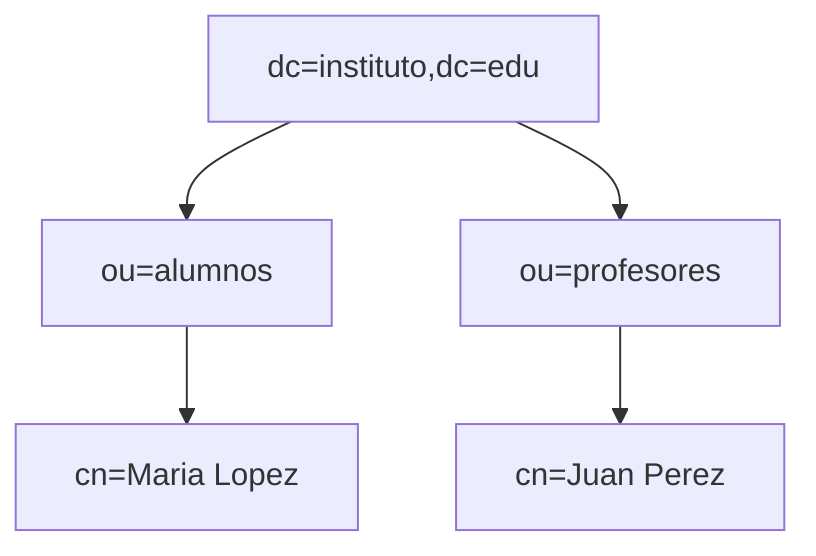
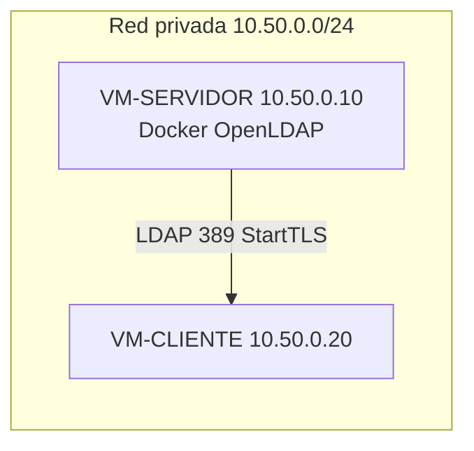

# 🔧 Actividades – Bloque 1: Conceptos Fundamentales de LDAP

> Todas las actividades se pueden resolver con los conceptos y ejemplos de la **Teoría**.
> Convención en actividades: usa `dc=empresa,dc=local` salvo que se indique lo contrario (las prácticas guiadas usan `dc=asir,dc=local`).

---

## Nivel 1 – Fundamentos

### 1. Comparativa LDAP vs SQL
Completa una tabla técnica con 6 criterios: estructura, rendimiento (lectura/escritura), seguridad, transacciones, esquema, casos de uso.

### 2. Vocabulario DIT
Dado un árbol, identifica **DN**, **RDN**, **OU**, **CN** y **DC** de 5 entradas diferentes.



---

## Nivel 2 – Aplicación

### 3. Diseña tu DIT (empresa)

Crea un DIT para `dc=empresa,dc=local` con:

- `ou=Usuarios`, `ou=Departamentos` (Ventas/Soporte), `ou=Grupos`.
- 4 usuarios `inetOrgPerson` y 2 grupos (`groupOfNames` con `member:` DN).
- Diagrama del DIT.

### 4. LDIF de altas y cambios
Crea `altas.ldif` con OU+2 usuarios.  
Crea `cambios.ldif` con **add** de un atributo y **replace** de otro.  


### 5. Búsquedas con base, alcance y filtros

1) Devuelve **solo** la entrada base (alcance `base`).  
2) Lista **hijos directos** de `ou=Usuarios` (alcance `one`).  
3) Encuentra en **todo el subárbol** a usuarios con `sn=Lopez`(esto depende de tu usuario) (alcance `sub`).  
4) Filtro combinado: `inetOrgPerson` de Ventas **o** Soporte cuyo `cn` empiece por `M`.

---

### 6. PHPmyAdmin

Ahora realiza los ejercicios anteriores con la aplicación web phpmyadmin. Claro esta, crea otros usuarios, modificalos, borrarlos. etc..

## Nivel 3 – Análisis/Creación

### 7. Secuencia funcional LDAP
Crea un **sequenceDiagram ** con: `bind → search → result → modify → result → unbind`.

### 8. DSML y exportación
Explica **cuándo** usarías **DSML** en lugar de LDIF en un entorno real y dibuja un flujo simple  que lo muestre.

---

## Nivel 4 – Escenario profesional

### 9. Montaje del escenario y diagrama de red
Reproduce el siguiente esquema y úsalo como guía del laboratorio:



**Pasos detallados (red y VMs):**
1. Crea una red privada en VirtualBox: `10.50.0.0/24`.
2. Crea dos VMs Ubuntu:
   - VM-SERVIDOR: `10.50.0.10`
   - VM-CLIENTE: `10.50.0.20`
3. Configura el adaptador 2 de cada VM en **Host-Only** (la red privada) y deja el adaptador 1 en **NAT** para Internet.
4. Asigna IP fija en cada VM (netplan):
   - VM-SERVIDOR: interfaz Host-Only con `10.50.0.10/24`
   - VM-CLIENTE: interfaz Host-Only con `10.50.0.20/24`
5. Comprueba conectividad:
   - En la VM-CLIENTE: `ping -c 4 10.50.0.10`
   - En la VM-SERVIDOR: `ping -c 4 10.50.0.20`
6. Comprueba que el puerto LDAP está accesible:
   - En la VM-CLIENTE: `nc -zv 10.50.0.10 389` (o `telnet 10.50.0.10 389`)

**Entrega:** captura del diagrama, IPs configuradas y salida de los pings/puerto 389.

### 10. TLS/StartTLS en OpenLDAP (Docker)
En la carpeta del laboratorio:
1. Crea una carpeta `certs/` junto al `docker-compose.yml`.
2. Genera una CA interna:
   ```bash
   openssl req -x509 -newkey rsa:2048 -sha256 -days 3650 -nodes \
     -keyout certs/ca.key -out certs/ca.crt -subj "/CN=LDAP Lab CA"
   ```
3. Crea clave y CSR del servidor (CN con la IP o el nombre):
   ```bash
   openssl req -newkey rsa:2048 -nodes \
     -keyout certs/ldap.key -out certs/ldap.csr -subj "/CN=10.50.0.10"
   ```
4. Añade SAN con IP/hostname:
   ```bash
   cat > certs/ldap.ext <<'EOF'
   subjectAltName = IP:10.50.0.10, DNS:vm-servidor
   EOF
   ```
5. Firma el certificado con la CA:
   ```bash
   openssl x509 -req -in certs/ldap.csr -CA certs/ca.crt -CAkey certs/ca.key \
     -CAcreateserial -out certs/ldap.crt -days 3650 -sha256 -extfile certs/ldap.ext
   ```
6. Ajusta permisos:
   ```bash
   chmod 600 certs/ldap.key certs/ca.key
   ```
7. Modifica `docker-compose.yml` (OpenLDAP):
   - `LDAP_TLS=true`
   - `LDAP_TLS_CRT_FILENAME=ldap.crt`
   - `LDAP_TLS_KEY_FILENAME=ldap.key`
   - `LDAP_TLS_CA_CRT_FILENAME=ca.crt`
   - `LDAP_TLS_VERIFY_CLIENT=never`
   - Volumen: `./certs:/container/service/slapd/assets/certs:ro`
8. **Reinicia limpio** para aplicar TLS:
   ```bash
   docker compose down -v
   docker compose up -d
   ```
9. Verifica StartTLS desde la VM-CLIENTE:
   ```bash
   ldapsearch -x -ZZ -H ldap://10.50.0.10:389 \
     -D "cn=admin,dc=asir,dc=local" -w admin123 \
     -b "dc=asir,dc=local" "(uid=*)" dn
   openssl s_client -connect 10.50.0.10:389 -starttls ldap
   ```
10. (Opcional) publica `636:636` y prueba `ldaps://10.50.0.10:636`.

**Entrega:** comandos de generación de certificados, fragmento del `docker-compose.yml`, y salidas de `ldapsearch -ZZ` y `openssl s_client`.

---

# 🔒 Bloque 2: ACL en LDAP (slapd)

### 11. Lee y entiende las ACL actuales
- Con `ldapsearch -LLL -Y EXTERNAL -H ldapi:/// -b cn=config olcAccess` documenta el orden y efecto de cada regla.
- Resume en 4 líneas quién puede hacer qué y qué pasa con el acceso anónimo.

### 12. Self-service seguro
Aplica una ACL que permita a cada usuario modificar **solo** sus atributos `mail` y `telephoneNumber`, pero no `userPassword`. Valida con:
- `ldapwhoami` de un usuario normal.
- `ldapmodify` cambiando su `mail` (debe funcionar).
- `ldapmodify` cambiando `userPassword` (debe fallar).

### 13. Lectura para aplicaciones, escritura solo para admins
Define ACL que cumplan:
- `cn=admin,dc=empresa,dc=local` → `manage` sobre todo.
- Grupo `cn=app-rw,ou=Grupos,dc=empresa,dc=local` → `write` solo en `ou=Aplicaciones,dc=empresa,dc=local`.
- Usuarios autenticados (`users`) → `read` sobre el árbol completo excepto `userPassword`.
- Anónimo (`anonymous`) → solo `auth`.
Entrega el LDIF aplicado y la salida de `ldapsearch` con las ACL ordenadas.

### 14. Auditoría mínima
Crea un script/bloque de comandos que:
- Haga backup de `olcAccess` (`slapcat -b cn=config | grep olcAccess`).
- Aplique un LDIF de cambio.
- Compruebe con `ldapsearch` que el orden `{0},{1},...` es el esperado.
Incluye el script y un ejemplo de ejecución en el laboratorio Docker.
