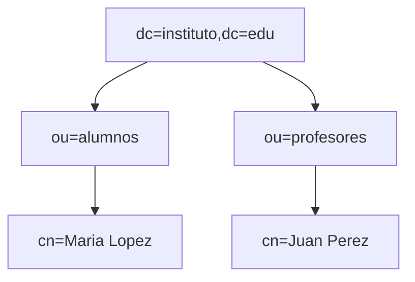

# 🔧 Actividades – Bloque 1: Conceptos Fundamentales de LDAP

> Todas las actividades se pueden resolver con los conceptos y ejemplos de la **Teoría**.

---

## Nivel 1 – Fundamentos

### 1. Comparativa LDAP vs SQL
Completa una tabla técnica con 6 criterios: estructura, rendimiento (lectura/escritura), seguridad, transacciones, esquema, casos de uso.

### 2. Vocabulario DIT
Dado un árbol, identifica **DN**, **RDN**, **OU**, **CN** y **DC** de 5 entradas diferentes.

---

## Nivel 2 – Aplicación

### 3. Diseña tu DIT (empresa)

Crea un DIT para `dc=empresa,dc=com` con:

- `ou=Usuarios`, `ou=Departamentos` (Ventas/Soporte), `ou=Grupos`.
- 4 usuarios `inetOrgPerson` y 2 grupos (`groupOfNames` con `member:` DN).
- Diagrama del DIT.

### 4. LDIF de altas y cambios
Crea `altas.ldif` con OU+2 usuarios.  
Crea `cambios.ldif` con **add** de un atributo y **replace** de otro.  

### 5. Búsquedas con base, alcance y filtros

1) Devuelve **solo** la entrada base (alcance `base`).  
2) Lista **hijos directos** de `ou=Usuarios` (alcance `one`).  
3) Encuentra en **todo el subárbol** a usuarios con `sn=Lopez`(esto depende de tu usuario) (alcance `sub`).  
4) Filtro combinado: `inetOrgPerson` de Ventas **o** Soporte cuyo `cn` empiece por `M`.

---

### 6. PHPmyAdmin

Ahora realiza los ejercicios anteriores con la aplicación web phpmyadmin. Claro esta, crea otros usuarios, modificalos, borrarlos. etc..

## Nivel 3 – Análisis/Creación

### 7. Secuencia funcional LDAP
Crea un **sequenceDiagram ** con: `bind → search → result → modify → result → unbind`.

### 8. DSML y exportación
Explica **cuándo** usarías **DSML** en lugar de LDIF en un entorno real y dibuja un flujo simple  que lo muestre.

---

## Nivel 4 – Escenario profesional

### 9. Endurece el laboratorio Docker con TLS
En la carpeta del laboratorio:
- Genera una **CA interna** y firma un certificado para `asir.local` (incluye SAN con el host/IP que uses).
- Monta los certificados en `openldap` mediante `docker-compose.yml`, habilita `LDAP_TLS`, fuerza conexiones cifradas y ajusta `phpLDAPadmin` para servir por HTTPS.
- Demuestra la configuración con dos capturas de comandos: `ldapsearch` contra `ldaps://` y `openssl s_client` mostrando el certificado emitido por tu CA.

---

# 🔒 Bloque 2: ACL en LDAP (slapd)

### 10. Lee y entiende las ACL actuales
- Con `ldapsearch -LLL -Y EXTERNAL -H ldapi:/// -b cn=config olcAccess` documenta el orden y efecto de cada regla.
- Resume en 4 líneas quién puede hacer qué y qué pasa con el acceso anónimo.

### 11. Self-service seguro
Aplica una ACL que permita a cada usuario modificar **solo** sus atributos `mail` y `telephoneNumber`, pero no `userPassword`. Valida con:
- `ldapwhoami` de un usuario normal.
- `ldapmodify` cambiando su `mail` (debe funcionar).
- `ldapmodify` cambiando `userPassword` (debe fallar).

### 12. Lectura para aplicaciones, escritura solo para admins
Define ACL que cumplan:
- `cn=admin,dc=empresa,dc=com` → `manage` sobre todo.
- Grupo `cn=app-rw,ou=Grupos,dc=empresa,dc=com` → `write` solo en `ou=Aplicaciones,dc=empresa,dc=com`.
- Usuarios autenticados (`users`) → `read` sobre el árbol completo excepto `userPassword`.
- Anónimo (`anonymous`) → solo `auth`.
Entrega el LDIF aplicado y la salida de `ldapsearch` con las ACL ordenadas.

### 13. Auditoría mínima
Crea un script/bloque de comandos que:
- Haga backup de `olcAccess` (`slapcat -b cn=config | grep olcAccess`).
- Aplique un LDIF de cambio.
- Compruebe con `ldapsearch` que el orden `{0},{1},...` es el esperado.
Incluye el script y un ejemplo de ejecución en el laboratorio Docker.
