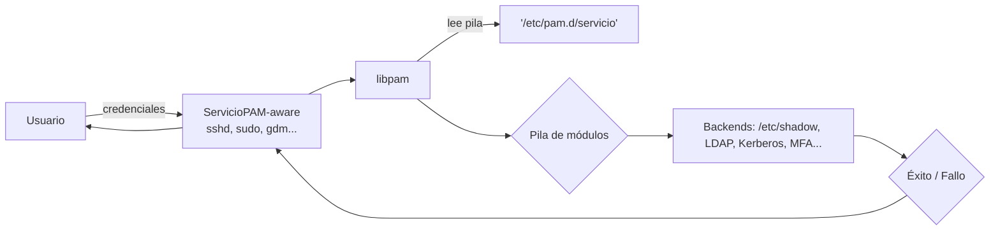
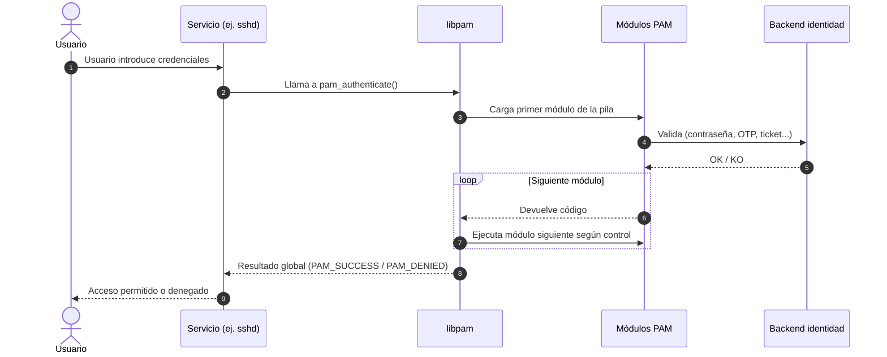
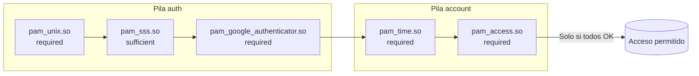

# PAM en Linux

> "Pluggable Authentication Modules" (PAM) es la capa que traduce las peticiones de autenticación de las aplicaciones en llamadas a los mecanismos que realmente validan a los usuarios.

## ¿Qué aporta PAM?

- **Separación de responsabilidades**: las aplicaciones delegan la autenticación y tú solo tocas las pilas PAM.  
- **Flexibilidad**: puedes añadir LDAP, Kerberos o un segundo factor sin reprogramar ningún servicio.  
- **Control fino**: decides quién entra, cuándo y bajo qué condiciones.  
- **Estabilidad**: si entiendes la pila, evitas dejar fuera a toda la empresa tras un cambio.

PIENSA EN PAM como una **centralita**: las llamadas (peticiones de login) llegan al operador (libpam) y este las redirige al departamento adecuado (módulos) según un guion (fichero en `/etc/pam.d/servicio`).




## Componentes y flujo de trabajo

1. **Aplicación PAM-aware**: servicios como `sshd`, `sudo`, `login` o `gdm` que llaman a la biblioteca PAM.
2. **Biblioteca PAM (`libpam`)**: interpreta la configuración en `/etc/pam.d/` y carga la pila de módulos que corresponda.
3. **Módulos PAM**: ejecutan las comprobaciones necesarias (consultar `/etc/shadow`, hacer bind contra LDAP, invocar SSSD, validar un OTP, etc.).



Si todos los módulos críticos devuelven éxito, la autenticación continúa. Un fallo en un módulo marcado como imprescindible provoca el rechazo del acceso, incluso si otros módulos han tenido éxito.

## Cómo se lee una línea de PAM

Cada línea de configuración en `/etc/pam.d/<servicio>` define:

```text
<tipo>  <control>  <módulo>  <argumentos>
```

- **Tipos**:

    - `auth`: valida credenciales (contraseña, token, llave pública).
    - `account`: comprueba políticas de acceso (vigencia de la cuenta, horarios, grupos).
    - `password`: gestiona el cambio o sincronización de contraseñas.
    - `session`: tareas que ocurren al abrir o cerrar sesión (montar directorios, registrar eventos).
    
- **Controles** (deciden qué hacer con el resultado):
    - `required`: debe pasar; aunque falle, se siguen evaluando módulos para no dar pistas al usuario.
    - `requisite`: si falla, detiene la pila inmediatamente y corta el acceso.
    - `sufficient`: si pasa y no hubo fallos previos, finaliza la pila con éxito.
    - `optional`: se ejecuta, pero su resultado solo cuenta si es el único módulo del tipo.
    - `include`: inserta otra pila (frecuente en `common-auth` de Debian o `system-auth` de Red Hat).

| Flag         | Éxito               | Fallo             | Continúa |
| ------------ | ------------------- | ----------------- | -------- |
| `required`   | cuenta              | cuenta (recuerda) | Sí       |
| `requisite`  | cuenta              | aborta            | No       |
| `sufficient` | **éxito inmediato** | ignorado          | Sí       |
| `optional`   | solo si es el único | ignorado          | Sí       |


## Dónde se configura PAM

- `/etc/pam.d/`: un archivo por servicio define su pila (por ejemplo `sshd`, `sudo`, `login`).
- `/etc/pam.d/common-*`: usados en Debian/Ubuntu para reutilizar pilas.
- `/etc/pam.d/system-auth` y `/etc/pam.d/password-auth`: equivalentes en Red Hat, AlmaLinux o CentOS.
- `/usr/lib/pam/`: ubicación típica de los módulos `.so`.

### Ejemplo comentado (Debian/Ubuntu, `/etc/pam.d/sshd`)

```bash
auth    required        pam_env.so                 # Carga variables de entorno definidas en /etc/security/pam_env.conf
auth    requisite       pam_nologin.so             # Bloquea logins si existe /etc/nologin (mantener durante mantenimientos)
auth    include         common-auth                # Llama a la pila compartida donde suele estar pam_unix, pam_sss...
account required        pam_nologin.so             # Segunda barrera: evita que cuentas sin shell sigan
account include         common-account             # Aplica políticas de caducidad, grupos, etc.
session required        pam_limits.so              # Aplica límites de recursos desde /etc/security/limits.conf
session include         common-session             # Resto de tareas (mkhomedir, systemd, logs...)
```

Los archivos `common-*` suelen contener la integración con SSSD o LDAP, de forma que cualquier servicio que los `include` hereda la configuración centralizada.

## Escenarios típicos 

- **Solo cuentas locales**: `pam_unix.so` consulta `/etc/shadow` y mantiene la autenticación tradicional.
- **LDAP/AD con caché**: `pam_sss.so` (SSSD) habla con el directorio, guarda credenciales en caché y permite logins sin conexión temporalmente.
- **Doble factor (MFA)**: `pam_google_authenticator.so` o `pam_oath.so` añade un OTP tras la contraseña.
- **Control de horarios**: `pam_time.so` permite o deniega accesos según día y hora.
- **Restricción por origen**: `pam_access.so` bloquea logins desde determinados hosts o redes.



## Mini caso práctico: exigir OTP en `sudo`

1. **Preparación**  
   - Instala el paquete: `sudo apt install libpam-google-authenticator`.  
   - Para el usuario administrador, ejecuta `google-authenticator` y guarda el código QR/clave secreta.
2. **Configura PAM**  
   Edita `/etc/pam.d/sudo` y añade arriba:
   ```text
   auth    required    pam_google_authenticator.so   nullok
   ```
   - `required`: si falla, `sudo` niega el acceso.  
   - `nullok`: permite a usuarios que aún no inicializaron OTP seguir con contraseña normal (activa solo durante migración).
3. **Prueba controlada**  
   - Abre una consola como root, por si algo va mal.  
   - Ejecuta `sudo -k` para forzar un nuevo reto y comprueba que pide contraseña + OTP.
4. **Revisión de logs**  
   - `sudo journalctl -t sudo` o `grep sudo /var/log/auth.log` para ver los códigos de retorno.

## Integración con LDAP, SSSD y otros backends

- **LDAP directo (`pam_ldap.so`)**: el módulo dialoga con el servidor LDAP, verifica credenciales y obtiene atributos. Necesita definir servidores, DN de bind y política de contraseñas. Es sensible a caídas de red si no se acompaña de caché.
- **SSSD (`pam_sss.so`)**: actúa como intermediario que combina múltiples fuentes (LDAP, AD, Kerberos, local) y añade caché de credenciales. PAM delega la validación en SSSD, mientras que `nsswitch.conf` usa `sss` para la resolución de cuentas.
- **Kerberos (`pam_krb5.so`)**: obtiene tickets TGT y gestiona renovación. Puede convivir con LDAP/SSSD para resolución de cuentas y autorizaciones.
- **MFA/OTP (`pam_google_authenticator.so`, `pam_oath.so`, etc.)**: añaden capas adicionales de verificación.

Cuando configuramos autenticación centralizada, la secuencia típica es:

1. `pam_sss.so` (o `pam_ldap.so`) valida la contraseña contra el directorio.
2. `pam_unix.so` puede mantenerse como respaldo para cuentas locales.
3. Módulos de política (`pam_access.so`, `pam_time.so`) deciden si se permite el acceso.
4. En la fase `session`, módulos como `pam_mkhomedir.so` crean el directorio personal para usuarios remotos.

## Checklist antes de tocar un servicio

- Ten una sesión root abierta en consola o TTY (si rompes PAM, ese será tu salvavidas).
- Documenta el estado original (`cp /etc/pam.d/sshd{,.bak}`) para volver atrás rápido.
- Tras cada cambio, ejecuta `pamtester <servicio> <usuario> authenticate` si lo tienes instalado.
- Revisa logs en `/var/log/auth.log`, `/var/log/secure` o `journalctl -u servicio`.
- Planifica el *rollback*: ¿qué pasa si LDAP cae?, ¿hay cuentas locales de emergencia?

Comprender PAM permite diseñar pilas coherentes, añadir autenticación centralizada y aplicar políticas sin perder control sobre la experiencia de inicio de sesión.
