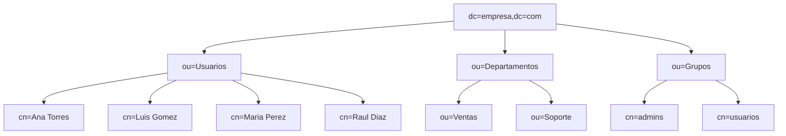
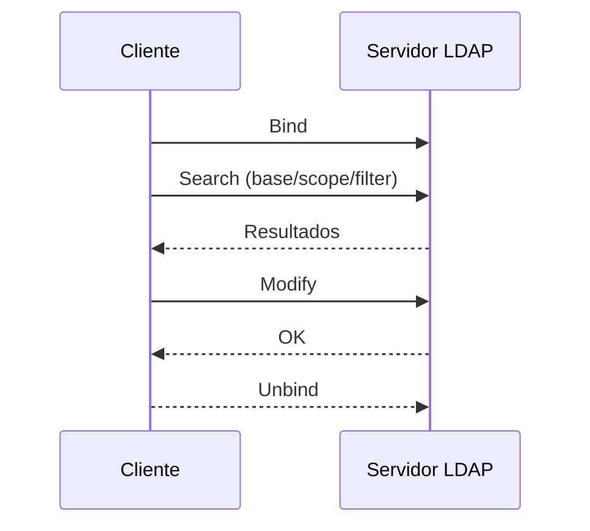
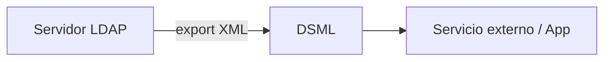

---
search:
  exclude: true
---

# ✅ Soluciones – Bloque 1

---

## 1. Comparativa LDAP vs SQL (posible solución)

| Criterio         | LDAP (DIT)                                      | SQL (Relacional)                         |
|------------------|--------------------------------------------------|------------------------------------------|
| Estructura       | Árbol (DN/RDN/OU/CN/DC)                         | Tablas/filas/columnas                    |
| Rendimiento      | Lecturas/búsquedas muy rápidas                  | Transacciones/joins complejos            |
| Seguridad        | ACL, SASL, TLS/LDAPS                             | Roles/privilegios                        |
| Transacciones    | No ACID completo                                 | ACID                                     |
| Esquema          | ObjectClass (MUST/MAY), atributos con sintaxis   | DDL (tipos, constraints)                 |
| Casos de uso     | Identidades, autenticación, correo, PKI          | Datos de negocio, inventarios, facturas  |

---

## 2. Vocabulario DIT (árbol del enunciado)

- **DN** de María: `cn=Maria Lopez,ou=alumnos,dc=instituto,dc=edu`  
- **RDN** de María: `cn=Maria Lopez`  
- **OU**: `ou=alumnos`, `ou=profesores`  
- **CN**: `cn=Maria Lopez`, `cn=Juan Perez`  
- **DC**: `dc=instituto`, `dc=edu`  

---

## 3. DIT (empresa) – ejemplo de solución



**Grupos `groupOfNames`:**
```ldif
dn: cn=admins,ou=Grupos,dc=empresa,dc=com
objectClass: groupOfNames
cn: admins
member: cn=Ana Torres,ou=Usuarios,dc=empresa,dc=com

dn: cn=usuarios,ou=Grupos,dc=empresa,dc=com
objectClass: groupOfNames
cn: usuarios
member: cn=Luis Gomez,ou=Usuarios,dc=empresa,dc=com
member: cn=Maria Perez,ou=Usuarios,dc=empresa,dc=com
```

---

## 4. LDIF de altas/cambios (ejemplo válido)

**`altas.ldif`**
```ldif
dn: ou=Usuarios,dc=empresa,dc=com
objectClass: organizationalUnit
ou: Usuarios

dn: cn=Ana Torres,ou=Usuarios,dc=empresa,dc=com
objectClass: inetOrgPerson
cn: Ana Torres
sn: Torres
uid: atorre
mail: atorre@empresa.com
userPassword: {SSHA}abc123

dn: cn=Luis Gomez,ou=Usuarios,dc=empresa,dc=com
objectClass: inetOrgPerson
cn: Luis Gomez
sn: Gomez
uid: lgomez
mail: lgomez@empresa.com
userPassword: {SSHA}xyz987
```

**`cambios.ldif`**
```ldif
dn: cn=Ana Torres,ou=Usuarios,dc=empresa,dc=com
changetype: modify
add: telephoneNumber
telephoneNumber: +34 600 111 222
-
replace: mail
mail: ana.torres@empresa.com
```

**Comandos:**
```bash
ldapadd   -x -H ldap://127.0.0.1:389 -D "cn=admin,dc=empresa,dc=com" -W -f altas.ldif
ldapmodify -x -H ldap://127.0.0.1:389 -D "cn=admin,dc=empresa,dc=com" -W -f cambios.ldif
```

---

## 5. Búsquedas: base, alcance y filtros

**1) Solo la base (alcance `base`):**
```bash
ldapsearch -x -b "dc=empresa,dc=com" -s base "(objectClass=*)" dn
```

**2) Hijos directos de `ou=Usuarios` (onelevel):**
```bash
ldapsearch -x -b "ou=Usuarios,dc=empresa,dc=com" -s one "(objectClass=inetOrgPerson)" cn
```

**3) Subárbol completo (subtree) con `sn=Lopez`:**
```bash
ldapsearch -x -b "dc=empresa,dc=com" -s sub "(sn=Lopez)" cn mail
```

**4) Filtro combinado (Ventas o Soporte cuyo `cn` empiece por M):**
```bash
ldapsearch -x -b "dc=empresa,dc=com" -s sub \
  "(& (objectClass=inetOrgPerson) (|(ou=Ventas)(ou=Soporte)) (cn=M*))" cn ou
```

---

## 6. Esquema personalizado (solución)

```ldif
dn: cn=schema,cn=config
changetype: modify
add: attributetypes
attributetypes: (1.3.6.1.4.1.9999.1 NAME 'cicloFormativo'
  DESC 'Ciclo formativo del alumno'
  EQUALITY caseIgnoreMatch
  SYNTAX 1.3.6.1.4.1.1466.115.121.1.15 )

add: objectclasses
objectclasses: (1.3.6.1.4.1.9999.2 NAME 'alumnoFP'
  SUP inetOrgPerson
  STRUCTURAL
  MUST (cn $ sn $ uid)
  MAY (mail $ cicloFormativo $ tutor) )
```

---

## 7. Secuencia funcional LDAP (solución)



---

## 8. DSML y exportación (solución)
**Cuándo DSML**: cuando se necesita **intercambio XML** con aplicaciones/servicios web (heterogéneos) que no consumen LDIF.  
**Flujo:**


---

### 9. Arquitectura con réplica

Diseña  una arquitectura con **slapd maestro** y **réplica**, 3 aplicaciones cliente (una de solo lectura), y señala **qué peticiones** van al maestro y cuáles a la réplica. Añade una nota sobre **TLS** y **ACL**.

## 10. Endurece el laboratorio Docker con TLS (solución)

1. **Estructura**  
   ```bash
   mkdir -p certs
   ```
2. **CA interna y certificado del servidor**  
   ```bash
   openssl req -x509 -newkey rsa:4096 -days 365 \
     -keyout certs/ca.key -out certs/ca.crt -nodes \
     -subj "/C=ES/ST=Valencia/O=ASIR2X/CN=CA OpenLDAP"

   openssl req -new -newkey rsa:4096 -keyout certs/asir.local.key \
     -out certs/asir.local.csr -nodes \
     -subj "/C=ES/ST=Valencia/O=ASIR2X/CN=asir.local"

   openssl x509 -req -in certs/asir.local.csr -CA certs/ca.crt -CAkey certs/ca.key \
     -CAcreateserial -out certs/asir.local.crt -days 365 -sha256 \
     -extfile <(printf "subjectAltName=DNS:asir.local,IP:127.0.0.1")
   ```
   Entrega `certs/ca.crt` (y opcionalmente `asir.local.crt`) a los clientes; la clave `asir.local.key` permanece solo en el servidor.

3. **`docker-compose.yml`**  
   ```yaml
   services:
     openldap:
       image: osixia/openldap:1.5.0
       environment:
         LDAP_ORGANISATION: "IES ASIR"
         LDAP_DOMAIN: "asir.local"
         LDAP_ADMIN_PASSWORD: "admin123"
         LDAP_TLS: "true"
         LDAP_TLS_ENFORCE: "true"
         LDAP_TLS_CRT_FILENAME: "asir.local.crt"
         LDAP_TLS_KEY_FILENAME: "asir.local.key"
         LDAP_TLS_CA_CRT_FILENAME: "ca.crt"
       ports:
         - "389:389"
         - "636:636"
       volumes:
         - ./datos/ldap:/var/lib/ldap
         - ./datos/slapd.d:/etc/ldap/slapd.d
         - ./config/bootstrap.ldif:/container/service/slapd/assets/config/bootstrap/ldif/50-bootstrap.ldif:ro
         - ./certs:/container/service/slapd/assets/certs:ro

     phpldapadmin:
       image: osixia/phpldapadmin:0.9.0
       environment:
         PHPLDAPADMIN_LDAP_HOSTS: openldap
         PHPLDAPADMIN_HTTPS: "true"
       ports:
         - "8443:443"
       depends_on:
         - openldap
       volumes:
         - ./certs/asir.local.crt:/container/service/phpldapadmin/assets/apache2/certs/server.crt:ro
         - ./certs/asir.local.key:/container/service/phpldapadmin/assets/apache2/certs/server.key:ro
         - ./certs/ca.crt:/container/service/phpldapadmin/assets/apache2/certs/ca.crt:ro
   ```
4. **Recrea y valida**  
   ```bash
   docker compose down
   docker compose up -d

   ldapsearch -H ldaps://localhost:636 -b "dc=asir,dc=local" -x
   ldapsearch -H ldap://localhost:389 -b "dc=asir,dc=local" -x -ZZ
   openssl s_client -connect localhost:636 -CAfile certs/ca.crt
   ```
   Guarda las salidas de `ldapsearch` y `openssl s_client` para adjuntarlas como evidencia.

---

# 🔒 Soluciones guía – ACL en LDAP (Bloque 2)

## 10. Leer ACL actuales
- Orden típico devuelto por `olcAccess` (ejemplo):
  1) `{0}to * by dn.exact="cn=admin,dc=empresa,dc=com" manage by * break`  
  2) `{1}to attrs=userPassword by self write by anonymous auth by * none`  
  3) `{2}to * by users read by anonymous auth`
- Resumen: admin gestiona todo; usuarios autenticados leen; anónimo solo puede autenticarse.

## 11. Self-service seguro
LDIF ejemplo:
```ldif
dn: olcDatabase={1}mdb,cn=config
changetype: modify
add: olcAccess
olcAccess: {3}to attrs=mail,telephoneNumber by self write by users read by * none
```
Validación: `ldapmodify` del usuario cambia `mail` ok; modificar `userPassword` devuelve `Insufficient access (50)`.

## 12. Lectura para apps, escritura solo admins
LDIF ejemplo (reemplaza DN/base por la de tu lab):
```ldif
dn: olcDatabase={1}mdb,cn=config
changetype: modify
add: olcAccess
olcAccess: {0}to * by dn.exact="cn=admin,dc=empresa,dc=com" manage by * break
olcAccess: {1}to attrs=userPassword by self write by anonymous auth by * none
olcAccess: {2}to dn.subtree="ou=Aplicaciones,dc=empresa,dc=com" by group.exact="cn=app-rw,ou=Grupos,dc=empresa,dc=com" write by users read by * none
olcAccess: {3}to * by users read by anonymous auth by * none
```
Salida esperada de `ldapsearch -b cn=config olcAccess` debe mostrar estos índices en orden.

## 13. Auditoría mínima (bash)
```bash
#!/usr/bin/env bash
set -e
BACKUP=backup-$(date +%F_%H%M)-olcAccess.ldif
echo "# Backup de olcAccess" > "$BACKUP"
ldapsearch -LLL -Y EXTERNAL -H ldapi:/// -b cn=config olcAccess >> "$BACKUP"

ldapmodify -Y EXTERNAL -H ldapi:/// -f cambios-acl.ldif

echo "# Orden tras aplicar" 
ldapsearch -LLL -Y EXTERNAL -H ldapi:/// -b cn=config olcAccess | grep '^olcAccess'
```
Ejecución: `chmod +x audit-acl.sh && ./audit-acl.sh`. Adjunta el backup generado y la salida final.
