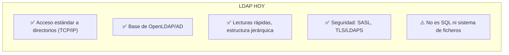
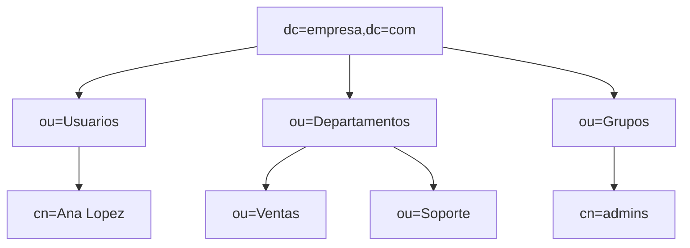
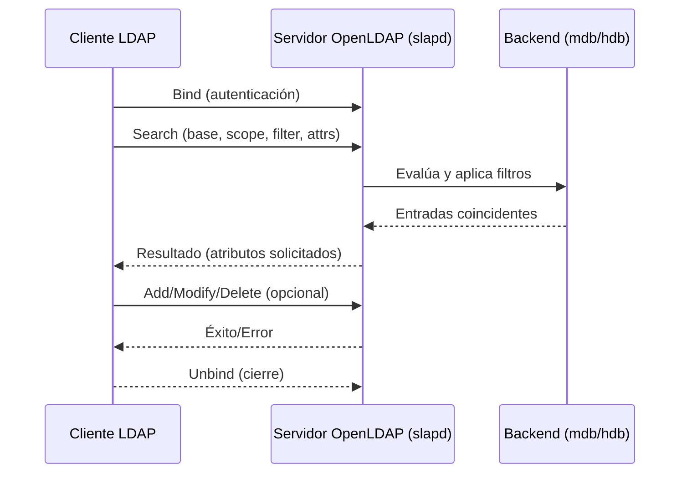
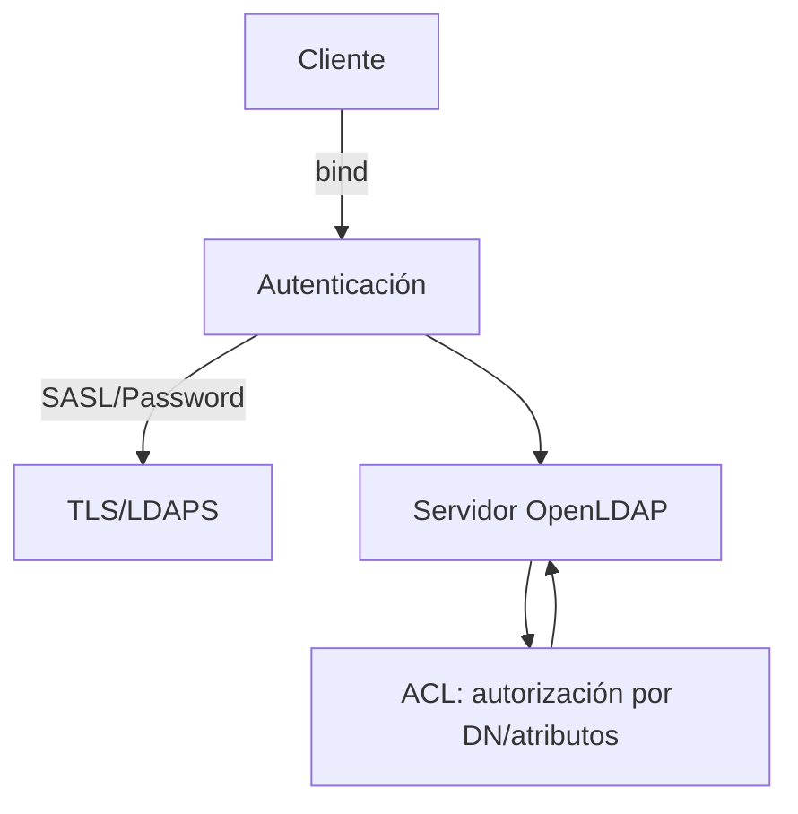
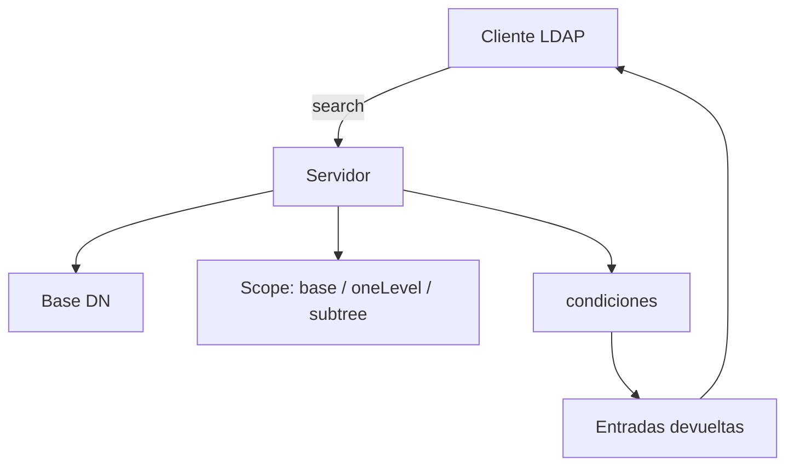
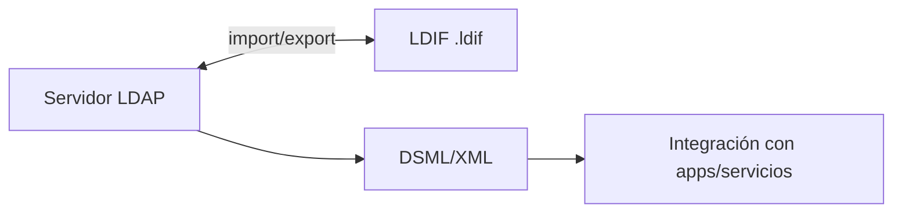

# 🧱 Bloque 1 – Conceptos Fundamentales de LDAP

> "Comprender un servicio de directorio es entender el corazón de la gestión de identidades."

---

## 1. Introducción a LDAP y a los servicios de directorio

Un **servicio de directorio** es una base de datos **jerárquica y optimizada para lectura** que almacena información sobre recursos de red (usuarios, equipos, grupos) y facilita su **búsqueda** y **autenticación**. LDAP es el **protocolo estándar** cliente-servidor para acceder y modificar esa información (sobre TCP/IP).

**Puntos clave del documento base:**
- LDAP ofrece **búsqueda y recuperación** de información, y define operaciones para **añadir/actualizar/borrar** entradas.
- **Origen X.500**: LDAP simplifica X.500 para hacerlo práctico en TCP/IP. Muchos servidores X.500 incorporaron **pasarelas LDAP**.
- LDAP **no** es una BBDD relacional, ni un sistema de ficheros para objetos grandes, ni óptimo para datos muy dinámicos.

### **LDAP HOY**



---

## 2. Modelos de LDAP

LDAP se entiende mejor con **cuatro modelos**: **información**, **nombrado**, **funcional** y **seguridad**.

### 2.1 Modelo de información
Este modelo provee de las estructuras y tipos de datos necesarios para construir un árbol de directorios LDAP. La unidad básica en un directorio LDAP es la entrada. Una entrada se puede ver como un nodo en el árbol de
información de directorio (DIT). Una entrada contiene información sobre una
instancia de uno o más objectClass. Estos objectClass son unos objetos que
tienen ciertos atributos, algunos opcionales y otros obligatorios. Los
atributos pueden ser de distintos tipos y cada tipo lleva asociado reglas de
codificación y de coincidencia que tienen en cuenta cosas como qué tipo de
dato puede tomar este atributo o como compararlo en una búsqueda.
Veamos como sería una entrada simple.


**Ejemplo de entrada (LDIF):**

```ldif
dn: cn=Jose Martin,ou=People,dc=universidad,dc=edu
objectClass: inetOrgPerson
cn: Jose Martin
sn: Martin
uid: jmartin
mail: jmartin@universidad.edu
```

### 2.2 Modelo de nombrado
Las entradas se **organizan en árbol**. El **DN** se construye concatenando **RDNs** desde la raíz (sufijos `dc=...`). **Case-insensitive** en nombres de atributos; espacios en torno a `,` y `=` se ignoran.

- **DN (Distinguished Name)**: la “dirección completa” de una entrada. Es la suma de todos los RDN desde el nodo hasta la raíz, por ejemplo `cn=Ana Lopez,ou=Usuarios,dc=empresa,dc=com`.
- **RDN (Relative Distinguished Name)**: el fragmento que identifica a la entrada dentro de su rama. En el ejemplo anterior, `cn=Ana Lopez` es el RDN dentro de `ou=Usuarios`.
- **OU (Organizational Unit)**: contenedor lógico para agrupar entradas relacionadas (departamentos, equipos, aulas). Aparece como `ou=...`.
- **CN (Common Name)**: nombre común de una entrada, usado para personas o grupos (`cn=Ana Lopez`, `cn=admins`).
- **DC (Domain Component)**: fragmento del dominio DNS usado en la raíz del directorio (`dc=empresa`, `dc=com`), ayuda a que la jerarquía refleje el dominio de la organización.



### 2.3 Modelo funcional
Operaciones del **protocolo**: `bind` (autenticación), `search` (búsqueda), **actualizaciones** (`add/modify/delete`), `unbind`.



### 2.4 Modelo de seguridad
- **Autenticación** (simple o **SASL**), **cifrado** (**TLS/LDAPS**), y **ACL** para autorización. LDAPv3 integra métodos, TLS es **operación extendida** estándar; LDAPS usa puerto **636**.



---

## 3. Búsquedas LDAP: base, alcance y filtros

Cuando ejecutamos un `search` estamos diciendo al servidor qué parte del árbol queremos examinar y qué condiciones deben cumplir las entradas que devuelva. Piensa en tres preguntas:

1. **¿Dónde empiezo?** → *Base DN*  
   Es el punto del árbol a partir del cual se busca (`dc=empresa,dc=com`, `ou=Usuarios,dc=empresa,dc=com`, etc.).

2. **¿Hasta dónde bajo?** → *Scope* (alcance)  
   - `base`: solo consulta la entrada indicada como base.  
   - `oneLevel`: revisa sus hijos directos (un único nivel).  
   - `subtree`: baja por todo el subárbol.

3. **¿Qué estoy buscando?** → *Filtro*  
   Es el conjunto de condiciones sobre atributos, parecido a un `WHERE`.



### 3.1 Scope y filtros en acción
| Scope | ¿Qué abarca? | Ejemplo de uso |
|-------|--------------|----------------|
| `base` | Solo la entrada del *base DN* | Leer atributos de `cn=admin,dc=empresa,dc=com` |
| `oneLevel` | Los hijos directos (1 nivel) | Listar usuarios dentro de `ou=Usuarios,dc=empresa,dc=com` |
| `subtree` | Toda la rama descendiente | Inventariar todas las entradas bajo `dc=empresa,dc=com` |

| Tipo de filtro | Sintaxis | ¿Qué hace? |
|----------------|----------|------------|
| Presencia | `(atributo=*)` | Devuelve entradas que tengan ese atributo |
| Igualdad | `(atributo=valor)` | Coincidencia exacta |
| Subcadenas | `(atributo=valor*)` | Compara prefijos o sufijos (`*valor*`) |
| OR | `(|(cond1)(cond2))` | Entradas que cumplan al menos una condición |
| AND | `(&(cond1)(cond2))` | Entradas que cumplan todas las condiciones |
| NOT | `(!(cond))` | Entradas que NO cumplan la condición |

Los filtros se pueden anidar: `(&(objectClass=person)(|(sn=Lopez)(sn=Perez)))` devuelve personas con apellido López **o** Pérez.


---

## 4. LDIF y DSML

**LDIF**: formato de texto para **representar/alterar** entradas y esquemas; soporta cambios (`changetype: modify`) y **Base64** para binarios. **DSML**: representación **XML** útil para integración con aplicaciones/servicios web.




---

