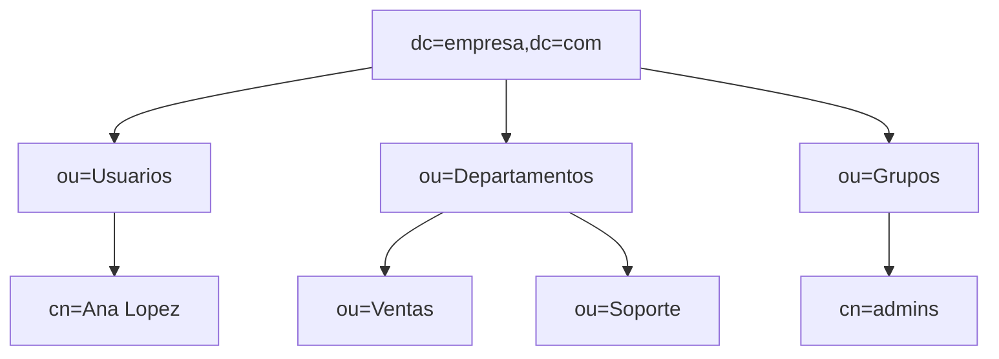
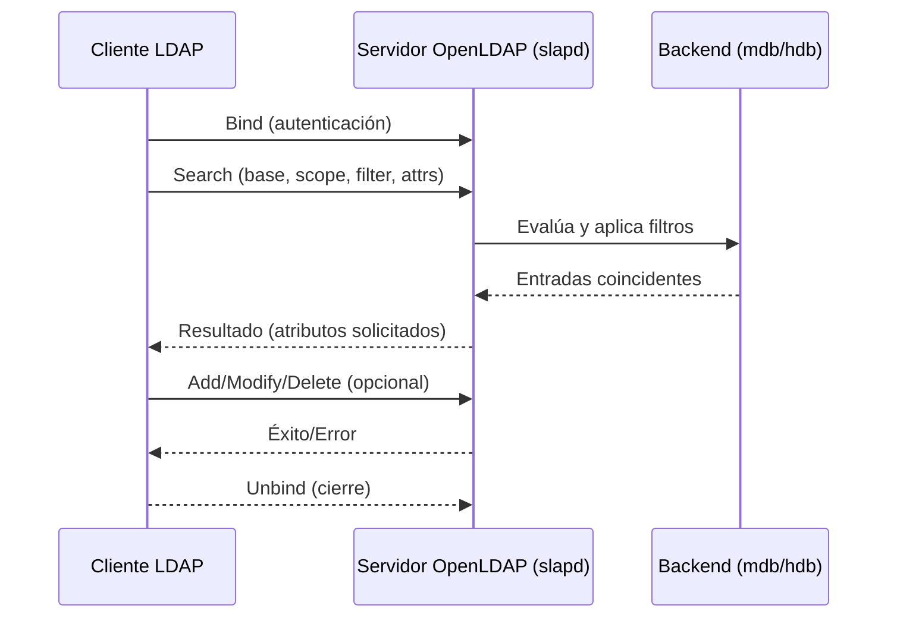
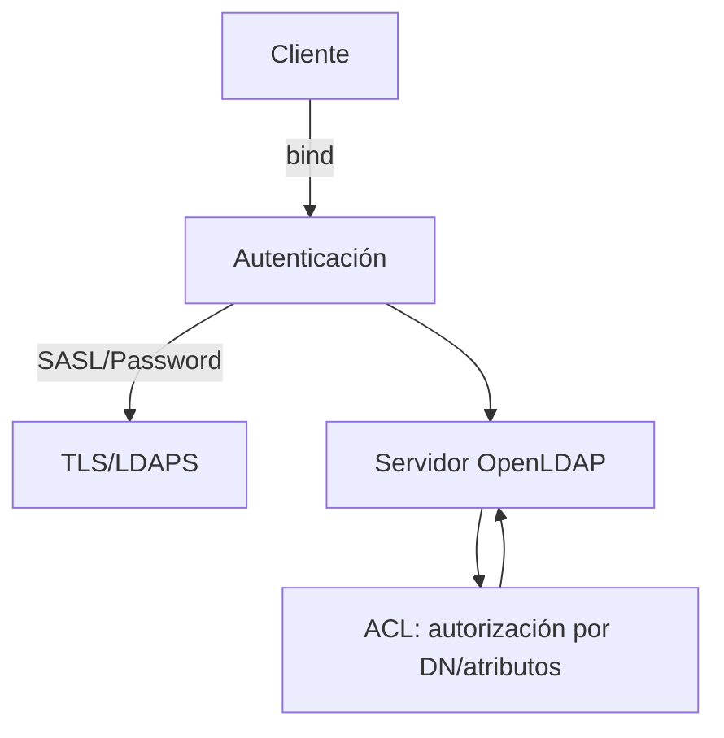
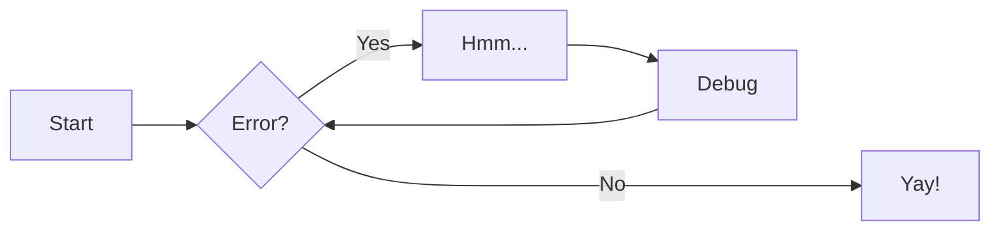
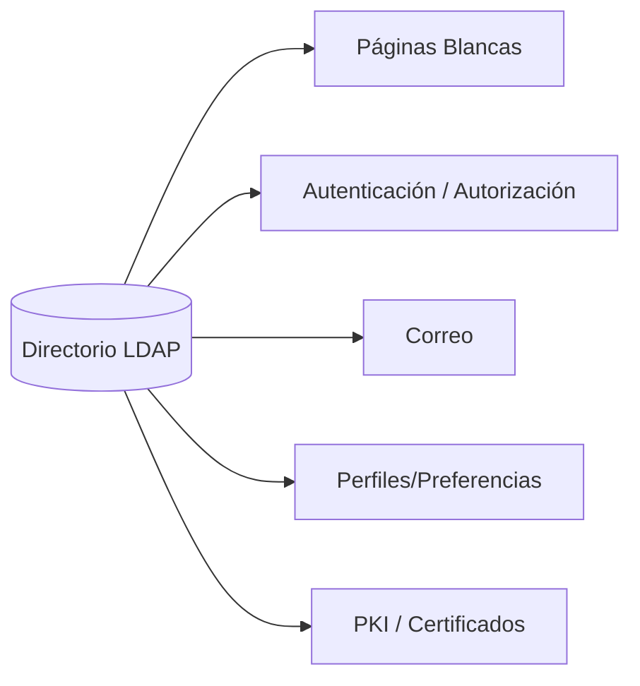

# 🧱 Bloque 1 – Conceptos Fundamentales de LDAP

> "Comprender un servicio de directorio es entender el corazón de la gestión de identidades."

---

## 1. Introducción a LDAP y a los servicios de directorio

Un **servicio de directorio** es una base de datos **jerárquica y optimizada para lectura** que almacena información sobre recursos de red (usuarios, equipos, grupos) y facilita su **búsqueda** y **autenticación**. LDAP es el **protocolo estándar** cliente-servidor para acceder y modificar esa información (sobre TCP/IP).

**Puntos clave del documento base:**
- LDAP ofrece **búsqueda y recuperación** de información, y define operaciones para **añadir/actualizar/borrar** entradas.
- **Origen X.500**: LDAP simplifica X.500 para hacerlo práctico en TCP/IP. Muchos servidores X.500 incorporaron **pasarelas LDAP**.
- LDAP **no** es una BBDD relacional, ni un sistema de ficheros para objetos grandes, ni óptimo para datos muy dinámicos.

### **LDAP HOY**

```mermaid
┌───────────────────────────────────────────────┐
│                    LDAP HOY                   │
├───────────────────────────────────────────────┤
│ ✅ Acceso estándar a directorios (TCP/IP)     │
│ ✅ Base de OpenLDAP/AD                        │
│ ✅ Lecturas rápidas, estructura jerárquica     │
│ ✅ Seguridad: SASL, TLS/LDAPS                  │
│ ⚠️ No es SQL ni sistema de ficheros            │
└───────────────────────────────────────────────┘
```

---

## 2. Modelos de LDAP

LDAP se entiende mejor con **cuatro modelos**: **información**, **nombrado**, **funcional** y **seguridad**.

### 2.1 Modelo de información
- **Entrada (entry)** = nodo del DIT, con **DN** y **atributos** que cumplen uno o más **objectClass**; cada clase define atributos **MUST**/**MAY** y sus reglas de coincidencia.

```c
classDiagram
    class Entry {
      +dn: DistinguishedName
      +atributos: {tipo: valor}
    }
    class ObjectClass {
      +name
      +must[]
      +may[]
    }
    class Atributo {
      +tipo
      +valor
    }
    Entry --> ObjectClass : "usa"
    Entry --> Atributo : "contiene"
```

**Ejemplo de entrada (LDIF):**

```ldif
dn: cn=Jose Martin,ou=People,dc=universidad,dc=edu
objectClass: inetOrgPerson
cn: Jose Martin
sn: Martin
uid: jmartin
mail: jmartin@universidad.edu
```

### 2.2 Modelo de nombrado
Las entradas se **organizan en árbol**. El **DN** se construye concatenando **RDNs** desde la raíz (sufijos `dc=...`). **Case-insensitive** en nombres de atributos; espacios en torno a `,` y `=` se ignoran.



### 2.3 Modelo funcional
Operaciones del **protocolo**: `bind` (autenticación), `search` (búsqueda), **actualizaciones** (`add/modify/delete`), `unbind`.



### 2.4 Modelo de seguridad
- **Autenticación** (simple o **SASL**), **cifrado** (**TLS/LDAPS**), y **ACL** para autorización. LDAPv3 integra métodos, TLS es **operación extendida** estándar; LDAPS usa puerto **636**.



---

## 3. Búsquedas LDAP: base, alcance y filtros

Un **search** define: **base DN**, **alcance** (base / un nivel / subárbol) y un **filtro**.





```mermaid
graphn
    A[Cliente LDAP] -->|search| B[Servidor]
    B --> C[(DIT)]
    B --> D1[Base DN]
    B --> D2[Scope: base / onelevel / subtree]
    B --> D3[Filtro (ej. (&(objectClass=person)(sn=Lopez)))]
    C --> B --> A
```

**Alcance:**  
- *base* → solo la entrada base.  
- *onelevel* → hijos directos (no incluye la base).  
- *subtree* → desde la base hacia abajo.

**Tipos de filtro:** presencia, igualdad, subcadenas, rangos, AND/OR/NOT.

---

## 4. LDIF y DSML

**LDIF**: formato de texto para **representar/alterar** entradas y esquemas; soporta cambios (`changetype: modify`) y **Base64** para binarios. **DSML**: representación **XML** útil para integración con aplicaciones/servicios web.

```mermaid
graph LR
    L[Servidor LDAP] <-->|import/export| F[LDIF .ldif]
    L --> X[DSML (XML)]
    X --> Apps[Integración con apps/servicios]
```

**Ejemplo LDIF – añadir OU y usuario**:
```ldif
dn: ou=People,dc=plainjoe,dc=org
objectClass: organizationalUnit
ou: People

dn: cn=Sam Smith,ou=People,dc=plainjoe,dc=org
objectClass: person
objectClass: organizationalPerson
cn: Sam Smith
sn: Smith
```

**Ejemplo LDIF – modify y schema (ilustrativo)**:
```ldif
dn: cn=jose martin,dc=ldap,dc=com
changetype: modify
add: description
description: aqui va la descripcion
-
replace: cn
cn: pepe martin
```
```ldif
objectclasses: (2.5.6.6 NAME 'person' SUP top MUST (sn $ cn) MAY (password $ telephoneNumber $ description))
```

---

## 5. OpenLDAP (slapd) y características relevantes

**slapd** implementa LDAPv3, soporta **SASL**, **TLS/SSL**, **ACL**, múltiples **backends**, i18n, control por topología, etc.

**Añadir entradas con `slapadd` vs herramientas en red (`ldapadd/ldapmodify`)**: `slap*` operan **directo sobre BD**; `ldap*` usan **protocolo**.

---

## 6. Ejemplos de comandos (para laboratorio)

> Base supuesta: `dc=empresa,dc=com` en `localhost`.

**Búsqueda “listarlo todo” desde la base:**
```bash
ldapsearch -x -H ldap://127.0.0.1:389 \
  -b "dc=empresa,dc=com" "(objectClass=*)" dn
```

**Alta de OU y usuario (por red):**
```bash
ldapadd -x -H ldap://127.0.0.1:389 -D "cn=admin,dc=empresa,dc=com" -W -f alta.ldif
```
`alta.ldif`:
```ldif
dn: ou=Usuarios,dc=empresa,dc=com
objectClass: organizationalUnit
ou: Usuarios

dn: cn=Ana Torres,ou=Usuarios,dc=empresa,dc=com
objectClass: inetOrgPerson
cn: Ana Torres
sn: Torres
uid: atorre
mail: atorre@empresa.com
userPassword: {SSHA}abc123
```

**Modificar atributo (replace):**
```bash
ldapmodify -x -H ldap://127.0.0.1:389 -D "cn=admin,dc=empresa,dc=com" -W -f cambio.ldif
```
`cambio.ldif`:
```ldif
dn: cn=Ana Torres,ou=Usuarios,dc=empresa,dc=com
changetype: modify
replace: mail
mail: ana.torres@empresa.com
```

---

## 7. Aplicaciones que usan LDAP

**Páginas blancas**, **Autenticación/Autorización**, **Correo**, **Perfiles**, **PKI**.

