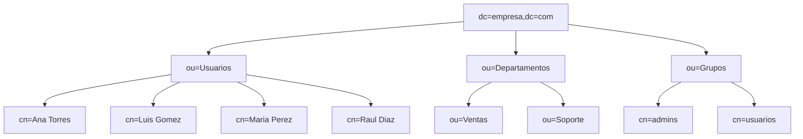
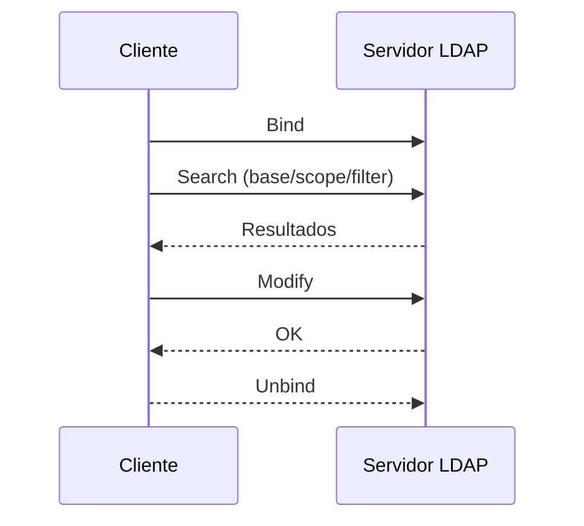
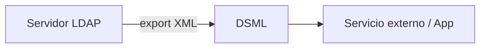

---
search:
  exclude: true
---

# ✅ Soluciones – Bloque 1

---

## 1. Comparativa LDAP vs SQL (posible solución)

| Criterio         | LDAP (DIT)                                      | SQL (Relacional)                         |
|------------------|--------------------------------------------------|------------------------------------------|
| Estructura       | Árbol (DN/RDN/OU/CN/DC)                         | Tablas/filas/columnas                    |
| Rendimiento      | Lecturas/búsquedas muy rápidas                  | Transacciones/joins complejos            |
| Seguridad        | ACL, SASL, TLS/LDAPS                             | Roles/privilegios                        |
| Transacciones    | No ACID completo                                 | ACID                                     |
| Esquema          | ObjectClass (MUST/MAY), atributos con sintaxis   | DDL (tipos, constraints)                 |
| Casos de uso     | Identidades, autenticación, correo, PKI          | Datos de negocio, inventarios, facturas  |

---

## 2. Vocabulario DIT (árbol del enunciado)

- **DN** de María: `cn=Maria Lopez,ou=alumnos,dc=instituto,dc=edu`  
- **RDN** de María: `cn=Maria Lopez`  
- **OU**: `ou=alumnos`, `ou=profesores`  
- **CN**: `cn=Maria Lopez`, `cn=Juan Perez`  
- **DC**: `dc=instituto`, `dc=edu`  

---

## 3. DIT (empresa) – ejemplo de solución



**Grupos `groupOfNames`:**
```ldif
dn: cn=admins,ou=Grupos,dc=empresa,dc=com
objectClass: groupOfNames
cn: admins
member: cn=Ana Torres,ou=Usuarios,dc=empresa,dc=com

dn: cn=usuarios,ou=Grupos,dc=empresa,dc=com
objectClass: groupOfNames
cn: usuarios
member: cn=Luis Gomez,ou=Usuarios,dc=empresa,dc=com
member: cn=Maria Perez,ou=Usuarios,dc=empresa,dc=com
```

---

## 4. LDIF de altas/cambios (ejemplo válido)

**`altas.ldif`**
```ldif
dn: ou=Usuarios,dc=empresa,dc=com
objectClass: organizationalUnit
ou: Usuarios

dn: cn=Ana Torres,ou=Usuarios,dc=empresa,dc=com
objectClass: inetOrgPerson
cn: Ana Torres
sn: Torres
uid: atorre
mail: atorre@empresa.com
userPassword: {SSHA}abc123

dn: cn=Luis Gomez,ou=Usuarios,dc=empresa,dc=com
objectClass: inetOrgPerson
cn: Luis Gomez
sn: Gomez
uid: lgomez
mail: lgomez@empresa.com
userPassword: {SSHA}xyz987
```

**`cambios.ldif`**
```ldif
dn: cn=Ana Torres,ou=Usuarios,dc=empresa,dc=com
changetype: modify
add: telephoneNumber
telephoneNumber: +34 600 111 222
-
replace: mail
mail: ana.torres@empresa.com
```

**Comandos:**
```bash
ldapadd   -x -H ldap://127.0.0.1:389 -D "cn=admin,dc=empresa,dc=com" -W -f altas.ldif
ldapmodify -x -H ldap://127.0.0.1:389 -D "cn=admin,dc=empresa,dc=com" -W -f cambios.ldif
```

---

## 5. Búsquedas: base, alcance y filtros

**1) Solo la base (alcance `base`):**
```bash
ldapsearch -x -b "dc=empresa,dc=com" -s base "(objectClass=*)" dn
```

**2) Hijos directos de `ou=Usuarios` (onelevel):**
```bash
ldapsearch -x -b "ou=Usuarios,dc=empresa,dc=com" -s one "(objectClass=inetOrgPerson)" cn
```

**3) Subárbol completo (subtree) con `sn=Lopez`:**
```bash
ldapsearch -x -b "dc=empresa,dc=com" -s sub "(sn=Lopez)" cn mail
```

**4) Filtro combinado (Ventas o Soporte cuyo `cn` empiece por M):**
```bash
ldapsearch -x -b "dc=empresa,dc=com" -s sub \
  "(& (objectClass=inetOrgPerson) (|(ou=Ventas)(ou=Soporte)) (cn=M*))" cn ou
```

---

## 6. Esquema personalizado (solución)

```ldif
dn: cn=schema,cn=config
changetype: modify
add: attributetypes
attributetypes: (1.3.6.1.4.1.9999.1 NAME 'cicloFormativo'
  DESC 'Ciclo formativo del alumno'
  EQUALITY caseIgnoreMatch
  SYNTAX 1.3.6.1.4.1.1466.115.121.1.15 )

add: objectclasses
objectclasses: (1.3.6.1.4.1.9999.2 NAME 'alumnoFP'
  SUP inetOrgPerson
  STRUCTURAL
  MUST (cn $ sn $ uid)
  MAY (mail $ cicloFormativo $ tutor) )
```

---

## 7. Secuencia funcional LDAP (solución)



---

## 8. DSML y exportación (solución)
**Cuándo DSML**: cuando se necesita **intercambio XML** con aplicaciones/servicios web (heterogéneos) que no consumen LDIF.  
**Flujo:**

