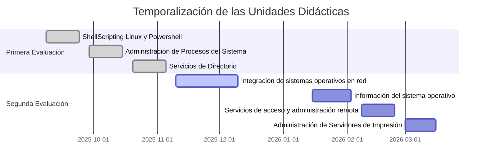

# Administración de Sistemas Operativos

Aquí puedes encontrar los apuntes del módulo de ***Administración de Sistemas Operativos***, que se imparte en el segundo curso del ciclo formativo de grado superior de Administración de Sistemas Informáticos en Red.

* La duración del módulo es de **85 horas lectivas**, a razón de **4 horas semanales**. Estas horas son totales que cubren las prácticas. 

## ¿Qué voy a aprender?

* Administrar sistemas operativos de servidor, instalando y configurando el software, en condiciones de calidad para asegurar el funcionamiento del sistema.
* Administrar servicios de recursos compartidos (acceso a directorios, impresión, accesos remotos, entre otros) instalando y configurando el software, en condiciones de calidad.
* Administrar usuarios de acuerdo a las especificaciones de explotación para garantizar los accesos y la disponibilidad de los recursos del sistema.
* Gestionar los recursos de diferentes sistemas operativos (programando y verificando su cumplimiento).

## Resultados de aprendizaje

Un *Resultado de Aprendizaje* **"es una declaración de lo que el estudiante se espera que conozca, comprenda y sea capaz de hacer al finalizar un periodo de aprendizaje".** Los resultados de aprendizaje de ASO vienen definidos en el [RD 1629/2009.](https://www.boe.es/eli/es/rd/2009/10/30/1629)

Los Resultados de Aprendizaje de ASO son:

1. Administra el servicio de directorio interpretando especificaciones e integrándolo en una red.
2. Administra procesos del sistema describiéndolos y aplicando criterios de seguridad y eficiencia.
3. Gestiona la automatización de tareas del sistema, aplicando criterios de eficiencia y utilizando comandos y herramientas gráficas.
4. Administra de forma remota el sistema operativo en red valorando su importancia y aplicando criterios de seguridad.
5. Administra servidores de impresión describiendo sus funciones e integrándolos en una red.
6. Integra sistemas operativos libres y propietarios, justificando y garantizando su interoperabilidad.
7. Utiliza lenguajes de guiones en sistemas operativos, describiendo su aplicación y administrando servicios del sistema operativo.

## Unidades didácticas / Temporalización

A continuación se muestran las unidades didácticas y una estimación temporal de cada una de ellas, ajustadas al calendario escolar y repartidas en cada evaluación con una duración aproximada de **32 sesiones**.

### Primera evaluación

1. **ShellScripting Linux y Powershell. (4 sesiones, 8 horas)**
    * Fechas: 8-sep-2025 al 24-sep-2025.
    * ShellScripting, creación scripts, variables, parámetros, operadores.
    * ShellScripting, Re-direcciones, tuberías.
    * Control de flujo en Shell, vectores.
2. **Administración de Procesos del Sistema. (4 sesiones, 8 horas)**
    * Fechas: 29-sep-2025 al 15-oct-2025 (excepto festivo 10-oct-2025).
    * Procesos. Tipos. Estados. Estructura. Transiciones, Hilos.
    * Planificador, Tipos de algoritmos de planificación, Sincronización e interrupciones entre procesos.
    * Gestión de procesos, demonios/servicios con Shell y Powershell.
3. **Servicios de Directorio (4 sesiones, 8 horas)**
    * Fechas: 20-oct-2025 al 5-nov-2025.
    * Libres: LDAP (No tiene que ser ese obligatorio).
    * Propietarios: Active Directory 
### Segunda evaluación
4. **Integración de sistemas operativos en red. (8 sesiones, 16 horas).**
    * Fechas: 10-nov-2025 al 10-dic-2025.
    * Escenarios heterogéneos, Protocolos para redes heterogéneas, servicios de recursos compartidos.
    * NFS, Instalación, Permisos, Montaje automático de un cliente NFS, configuración de ficheros.
    * NextCloud, Instalación, configuración de ficheros y permisos de usuario.
    * SAMBA, fichero configuración, Creación directorio compartido, Integración de permisos.
    * SAMBA, Administración de servicios con RSAT, perfiles de usuario y carpetas personales, cuotas.
5. **Información del sistema operativo (4 sesiones, 8 horas).**
    * Fechas: 15-ene-2026 al 3-feb-2026 (excepto festivo 16-feb-2026).
    * Estructura directorios. Búsqueda de información del sistema. Rendimiento. Estadísticas.
    * Planificación de Tareas, Programador de tareas, `crontab`.
    * Servicio Monitorización, Nagios, PRTG, OpenNMS.
6. **Servicios de acceso y administración remota (4 sesiones, 8 horas).** 
    * Fechas: 8-feb-2026 al 24-feb-2026.
    * Acceso remoto en modo texto `SSH`. Tunelización.
    * Escritorio Remoto:  RDP y xRDP. Acceso remoto de equipos en el AD con PWSH.
    * Herramientas gráficas externas, TeamViewer, AnyDesk y Apache Guacamole.
7. **Administración de Servidores de Impresión (4 sesiones, 8 horas).**
    * Fechas: 1-mar-2026 al 16-mar-2026 (excepto festivo 20-mar-2026).
    * Sistemas de Impresión, Puertos y protocolos de impresión.
    * Servidor de impresión en GNU/Linux, `CUPS`. Órdenes para la gestión de impresoras y trabajos.
    * Administración de los Servicios de Impresión en Windows Server.

## Diagrama de Gantt

A continuación se presenta un diagrama de Gantt que ilustra la temporalización de las unidades didácticas y sus fechas:

Este diagrama proporciona una visión general de las fechas y duración de cada unidad didáctica, incluyendo los festivos relevantes.

## Evaluación
### Instrumentos de calificación

1. **Instrumento de calificación 1 (IC1):**: *escala de valores* comprendidas entre 0 y 3 puntos calificados de la siguiente forma:
    * **0**: No entregada.
    * **1**: Entregada pero solución errónea o incompleta.
    * **2**: Entregada y solución aceptable, aunque tiene algún apartado incompleto.
    * **3**: Entregada y solución correcta.

2. **Instrumento de calificación 2 (IC2):** *escala de valores* comprendidas entre 0 y 7 puntos calificados de la siguiente forma:
    * **0**: No entregada
    * **1-3**: Entregada pero solución errónea o incompleta
    * **3-6**: Entregada y solución aceptable, aunque tiene algún apartado incompleto.
    * **7**: Entregada y solución correcta.
### Instrumentos de Evaluación
La nota de cada **Resultado de Aprendizaje** se calcula mediante la media ponderada de los puntos obtenidos, de los siguientes instrumentos de evaluación.

1. **Instrumento de Evaluación 1 (IE1). Trabajo en Clase/Actividades.**
    1. Se evalúan todas las actividades realizadas en clase y en casa.
    2. Las actividades se evalúan mediante tareas en el `moodle` aplicando el **IC1**.
    
2. **Instrumentos de Evaluación 2 (IE2). Pruebas de Auditoría.**
    1. Cuestionario multi-opción (test) de 20 preguntas sobre la teoría de la unidad.
    2. Ejercicios prácticos sobre las actividades realizadas de la unidad.

!!! not "**Nota**:"    
    Esta prueba se califica entre 0 y 30 puntos siguiendo las siguientes premisas:
- **0-10** puntos. Donde Cada dos contestaciones incorrectas contestadas resta una bien.
- **0-6** puntos: dos ejercicios de *nivel medio-bajo*, 3 puntos cada uno de ellos aplicando **IC1**.
- **0-14** puntos: dos ejercicios de *nivel medio-alto* aplicando **IC2**

