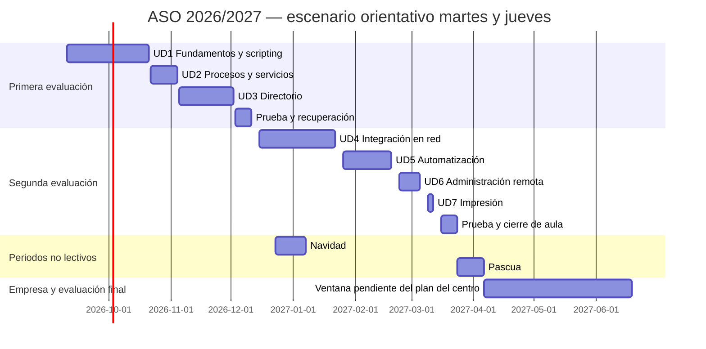

# Calendario y organización de ASO 2026/2027 — Elche

**Cuatro horas semanales. Dos evaluaciones en el centro y formación en empresa durante los últimos meses.** Actualizado: 16 de septiembre de 2026.

Aquí puedes consultar el orden de las unidades, las horas previstas de clase y los periodos de evaluación y formación en empresa.

!!! warning "Fechas de unidades y empresa pendientes de confirmación"
    La distribución por unidades es orientativa: utiliza martes y jueves, dos horas cada día, como horario de ejemplo. Consulta con el profesorado tu horario real y las fechas de las pruebas antes de organizarte. La incorporación a empresa requiere la confirmación del centro.

## Calendario escolar de Elche

| Concepto | Fecha o periodo |
|---|---|
| Inicio de FP | 9 de septiembre de 2026 |
| Navidad | 23 de diciembre de 2026 – 6 de enero de 2027, incluidos |
| Pascua | 24 de marzo – 5 de abril de 2027, incluidos |
| No lectivos locales de Elche | 7 de diciembre, 12 de febrero y 3 de mayo |
| Otros festivos dentro del calendario | 9 y 12 de octubre, 8 de diciembre y 19 de marzo |
| Fin del curso escolar de FP | 18 de junio de 2027 |

Se utiliza el calendario definitivo autorizado para Elche, que modifica el general autonómico. En El Altet, el 12 de febrero se sustituye por el 2 de octubre. Fuente: [Ayuntamiento de Elche, calendario definitivo publicado en agosto de 2026](https://www.elche.es/2026/08/elche-aprueba-el-calendario-escolar-definitivo-para-el-curso-2026-2027-con-un-no-lectivo-mas-en-semana-santa/).

## Horas del módulo

ASO tiene **133 horas curriculares y 4 horas semanales**, según el [Decreto 114/2025, tabla de ASIR, página 72](https://dogv.gva.es/datos/2025/08/04/pdf/2025_29742_es.pdf).

| Organización prevista | Horas |
|---|---:|
| Trabajo de las unidades UD1–UD7 en el centro | 92 |
| Pruebas, recuperación y cierre en el centro | 10 |
| **Total previsto en el centro** | **102** |
| Pendientes de distribuir por el centro | 31 |
| **Total del módulo** | **133** |

Las 31 horas pendientes no se consideran realizadas ni están asignadas todavía a empresa. El reparto definitivo dependerá del horario y del plan formativo del grupo. Los porcentajes de los resultados de aprendizaje indican su peso en la evaluación, no su duración.

## Unidades y evaluaciones en el centro

Con el horario de ejemplo de martes y jueves, hasta el 23 de marzo, se prevén **51 sesiones, 102 horas**, distribuidas en 92 horas para unidades y 10 para pruebas, recuperación y cierre. Las fechas de cada fila corresponden a su primera y última sesión; no implican clase todos los días del intervalo.

### Primera evaluación: septiembre – 10 de diciembre

| Bloque | Primera sesión | Última sesión | Horas de aula |
|---|---|---|---:|
| UD1. Fundamentos y scripting | 10/09/2026 | 20/10/2026 | 24 |
| UD2. Procesos y servicios | 22/10/2026 | 03/11/2026 | 8 |
| UD3. Servicios de directorio | 05/11/2026 | 01/12/2026 | 16 |
| Prueba y recuperación | 03/12/2026 | 10/12/2026 | 4 |
| **Total** | | | **52** |

UD1 incluye unas cinco horas de fundamentos dentro de sus 24 horas. Se prioriza Linux y se mantiene el trabajo necesario con sistemas propietarios para las evidencias que lo requieran; no se suma el repaso al presupuesto de horas.

### Segunda evaluación: 15 de diciembre – 23 de marzo

| Bloque | Primera sesión | Última sesión | Horas de aula |
|---|---|---|---:|
| UD4. Integración de sistemas en red | 15/12/2026 | 21/01/2027 | 16 |
| UD5. Automatización y mantenimiento | 26/01/2027 | 18/02/2027 | 16 |
| UD6. Administración remota | 23/02/2027 | 04/03/2027 | 8 |
| UD7. Impresión | 09/03/2027 | 11/03/2027 | 4 |
| Prueba, recuperación y preparación de empresa | 16/03/2027 | 23/03/2027 | 6 |
| **Total** | | | **50** |

Las sesiones de evaluación del equipo docente deben fijarlas el centro. Aquí las filas de prueba y recuperación reservan horas de clase; no se presentan como convocatorias oficiales ni como evaluación final del módulo.

### Cómo trabajarás las unidades

- En UD1 repasarás fundamentos de Linux y trabajarás scripting en Linux y PowerShell.
- En UD3 y UD4 reutilizarás el entorno LDAP y los usuarios en las prácticas de integración.
- En UD5 realizarás una selección de actividades de automatización y mantenimiento. El material completo incluye ampliaciones; el profesorado indicará las actividades obligatorias y las entregas.
- En UD6 y UD7 trabajarás la administración remota y los servicios de impresión.

Las actividades de refuerzo y ampliación te ayudan a practicar; su presencia en los apuntes no implica que todas sean entregas obligatorias.

## Formación en empresa y evaluación final

El periodo previsto es **del 6 de abril al 18 de junio de 2027**, pendiente de confirmación por el centro. Antes de incorporarte debes conocer tu fecha de inicio, jornada, calendario, actividades y forma de seguimiento.

La propuesta contempla **400 horas en segundo curso**, sujetas al plan formativo del grupo. Son horas del conjunto del ciclo, no 400 horas de ASO. El calendario de empresa puede diferir del calendario escolar: confirma los días de asistencia con el centro y tu tutoría de empresa.

La evaluación final tendrá en cuenta la formación realizada en empresa. Terminar las clases de la segunda evaluación no supone haber cerrado el módulo. Consulta los [resultados de aprendizaje y la evaluación](index.md#evaluacion).

## Diagrama de la propuesta

Las barras señalan intervalos, no horas de clase continuas. Las fechas de fin del diagrama son exclusivas para abarcar la última sesión indicada en las tablas.

## Información pendiente de confirmar

El profesorado y el centro deben concretar el horario por días, las fechas de pruebas y recuperación, el reparto de las 31 horas pendientes y el plan de formación en empresa. Hasta entonces, las fechas de las unidades y de incorporación que aparecen en esta página son orientativas.
