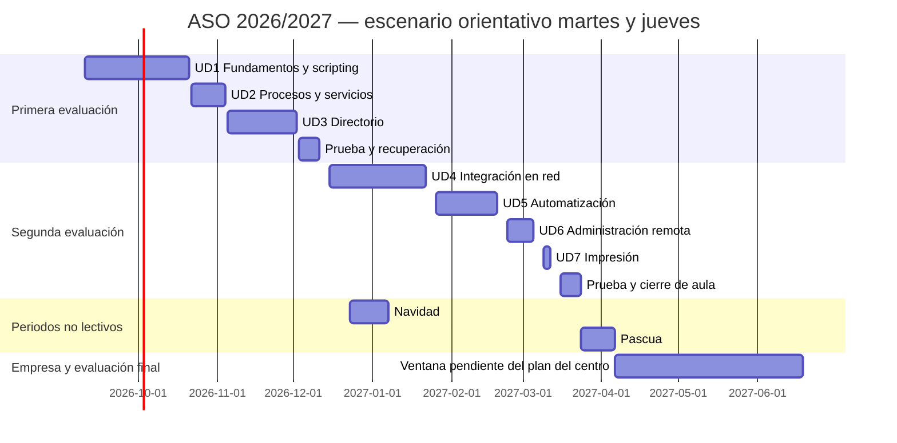

# Temporalización ASO 2026/2027 — Elche

**Cuatro horas semanales. Dos evaluaciones en el centro y formación en empresa durante los últimos meses.** Revisión: 10 de septiembre de 2026.

El calendario municipal está contrastado. Las fechas de unidades y empresa que siguen son una **propuesta de organización**, no las fechas aprobadas por el centro. Para calcular sesiones se ha usado como ejemplo martes y jueves, dos horas cada día; el docente aún no ha indicado los días reales.

## Calendario escolar de Elche

| Concepto | Fecha o periodo |
|---|---|
| Inicio de FP | 9 de septiembre de 2026 |
| Navidad | 23 de diciembre de 2026 – 6 de enero de 2027, incluidos |
| Pascua | 24 de marzo – 5 de abril de 2027, incluidos |
| No lectivos locales de Elche | 7 de diciembre, 12 de febrero y 3 de mayo |
| Otros festivos dentro del calendario | 9 y 12 de octubre, 8 de diciembre y 19 de marzo |
| Fin del curso escolar de FP | 18 de junio de 2027 |

Se utiliza el calendario definitivo autorizado para Elche, que modifica el general autonómico. En El Altet, el 12 de febrero se sustituye por el 2 de octubre. Fuente: [Ayuntamiento de Elche, calendario definitivo publicado en agosto de 2026](https://www.elche.es/2026/08/elche-aprueba-el-calendario-escolar-definitivo-para-el-curso-2026-2027-con-un-no-lectivo-mas-en-semana-santa/).

## Qué significan las 400 horas de empresa

Las instrucciones de FP de 2026/2027 establecen, para régimen general de grado medio/superior, entre el 25 % y el 35 % de la duración del ciclo en empresa, repartida entre cursos, y un mínimo de 100 horas en primero. En un ciclo de 2.000 horas, el intervalo es **500–700 horas**. Por tanto, **100 en primero + 400 en segundo es un reparto compatible**, no una duración universal obligatoria de segundo. Debe comprobarse en el plan formativo del grupo. [Resolución de 16 de julio de 2026, apartado 15.1.1, páginas 21–22](https://www.mclibre.org/consultar/legislacion/files/dogv/DOGV-2026-07-16-R-inicio-curso-fp-2627-es.pdf).

Las horas de empresa corresponden al conjunto del ciclo; no son 400 horas del módulo ASO. El currículo asigna a ASO **133 horas y 4 horas semanales**. [Decreto 114/2025, tabla de ASIR, página 72](https://dogv.gva.es/datos/2025/08/04/pdf/2025_29742_es.pdf).

## Escenario calculado de clases en el centro

Hipótesis: clases los martes y jueves, dos horas por sesión, hasta el 23 de marzo. Se descuentan los no lectivos anteriores. Resultan **51 sesiones, 102 horas**, distribuidas en 92 horas para unidades y 10 para pruebas, recuperación y cierre. Las fechas de cada fila corresponden a su primera y última sesión; no implican clase todos los días del intervalo.

### Primera evaluación: septiembre – 10 de diciembre

| Bloque | Primera sesión | Última sesión | Horas de aula |
|---|---|---|---:|
| UD1. Fundamentos y scripting | 10/09/2026 | 20/10/2026 | 24 |
| UD2. Procesos y servicios | 22/10/2026 | 03/11/2026 | 8 |
| UD3. Servicios de directorio | 05/11/2026 | 01/12/2026 | 16 |
| Prueba y recuperación | 03/12/2026 | 10/12/2026 | 4 |
| **Total** | | | **52** |

UD1 incluye unas cinco horas de fundamentos dentro de sus 24 horas. Se prioriza Linux y se mantiene el trabajo necesario con sistemas propietarios para las evidencias que lo requieran; no se suma el repaso al presupuesto de horas.

### Segunda evaluación: 15 de diciembre – 23 de marzo

| Bloque | Primera sesión | Última sesión | Horas de aula |
|---|---|---|---:|
| UD4. Integración de sistemas en red | 15/12/2026 | 21/01/2027 | 16 |
| UD5. Automatización y mantenimiento | 26/01/2027 | 18/02/2027 | 16 |
| UD6. Administración remota | 23/02/2027 | 04/03/2027 | 8 |
| UD7. Impresión | 09/03/2027 | 11/03/2027 | 4 |
| Prueba, recuperación y preparación de empresa | 16/03/2027 | 23/03/2027 | 6 |
| **Total** | | | **50** |

Las sesiones de evaluación del equipo docente deben fijarlas el centro. Aquí las filas de prueba y recuperación reservan horas de clase; no se presentan como convocatorias oficiales ni como evaluación final del módulo.

### Ajustes respecto al material completo

Este escenario no pretende desarrollar todos los ejercicios existentes en las horas reducidas. Se seleccionan prácticas integradas para reutilizar servidores y evidencias:

- UD3 y UD4 comparten el entorno LDAP y los usuarios; no se reinstala el laboratorio desde cero en cada unidad.
- UD5 conserva un itinerario completo de 24 horas como material de referencia y propone una selección de 16 horas: preparación de scripts (2), cron/at/KCron (4), timers (4), fiabilidad y cuentas (3), caso integrado y evidencias (3). Se parte de los scripts entregados y se reutilizan resultados, sin eliminar las evidencias de los criterios gráficos y de cuentas.
- UD6 reutiliza los servidores anteriores; UD7 se centra en una cola y pruebas desde cliente.
- Las actividades adicionales quedan como ampliación o refuerzo, sin computarlas ficticiamente como horas de clase.

**El balance curricular aún debe cerrarse con el plan de empresa:** 133 − 102 = 31 horas de ASO fuera de este escenario presencial. No se dan por realizadas ni se asignan automáticamente a empresa. El equipo docente deberá vincular la formación que corresponda a ASO con actividades y resultados de aprendizaje concretos, o revisar la distribución de clases. Las ponderaciones de RA no cambian por reducir el tiempo de un bloque.

### Si los días de clase son otros

Hasta el 23 de marzo hay 24 lunes, 25 martes, 25 miércoles, 26 jueves y 23 viernes lectivos en el calendario considerado. Con dos sesiones semanales de dos horas, el total puede variar entre **94 y 102 horas**. Si las cuatro horas estuvieran concentradas en un solo día, el intervalo sería 92–104 horas. No debe copiarse la tabla fechada como definitiva hasta sustituir el horario de ejemplo por el real.

## Ventana propuesta de formación en empresa

Se propone reservar **del 6 de abril al 18 de junio de 2027**, después de Pascua, para empresa y cierre del curso. Es una ventana de trabajo, no una fecha de incorporación confirmada.

| Jornada efectiva acordada | Tiempo necesario para 400 horas |
|---|---|
| 8 horas/día | 50 jornadas completas |
| 7 horas/día | 57 jornadas completas y una hora más; 58 días de asistencia |
| 6 horas/día | 66 jornadas completas y cuatro horas más; 67 días de asistencia |

Ejemplo aritmético: empezando el 6 de abril a ocho horas diarias, de lunes a viernes, sin asistir el 3 de mayo y sin otras interrupciones, las 400 horas se alcanzarían el **15 de junio**. Es necesario dejar margen para incidencias y cierre. Con siete horas diarias esa misma ventana no basta: habría que adelantar la incorporación o cambiar el calendario acordado.

El calendario efectivo de empresa debe incorporar jornada, festivos aplicables, asistencia al centro y seguimiento acordados. Los días no lectivos escolares no se convierten automáticamente en días sin actividad en empresa. La evaluación final tendrá en cuenta la formación realizada allí; no se considera cerrado ASO solo por terminar la segunda evaluación de aula. [Instrucciones 2026/2027, apartados 9.6 y 15](https://www.mclibre.org/consultar/legislacion/files/dogv/DOGV-2026-07-16-R-inicio-curso-fp-2627-es.pdf).

## Diagrama de la propuesta

Las barras señalan intervalos, no horas de clase continuas. Las fechas de fin del diagrama son exclusivas para abarcar la última sesión indicada en las tablas.

## Datos que debe cerrar el centro

El horario real de ASO, el reparto efectivo de horas de empresa entre primero y segundo, los resultados de aprendizaje que se desarrollarán en empresa, la jornada diaria de estancia y las fechas de evaluación. Estos datos concretan la propuesta; el calendario municipal y las cuatro horas semanales ya están incorporados.
